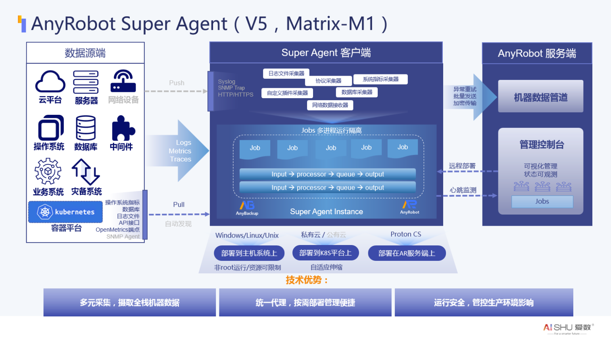
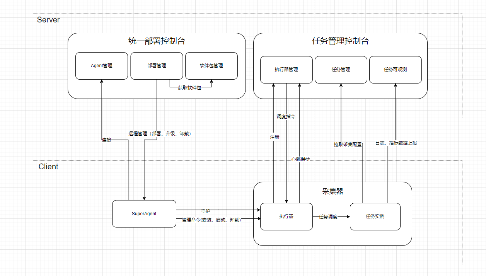

SuperAgent 是提供了统一的任务管理和调度能力的技术框架，包括统一的任务管理控制台、统一的任务调度流程和统一的任务部署管理。​

# 核心技术优势
- 统一代理
统一的采集任务管理功能，简化了任务管理的复杂度、提升了任务管理的易用性。统一的远程管理功能，屏蔽了用户部署采集任务客户端的具体细节，只需要在管理页面即可完成采集客户端的部署、升级、卸载。
- 多元采集
支持采集服务器和应用相关的日志、指标、链路数据，支持通过 HTTP、Syslog、Prometheus 等标准协议采集数据，支持自定义采集插件扩展个性化采集能力。
- 安全采集
采集器支持本地化采集或者远程采集满足生产系统的不同安全要求，同时支持非 root 安装，有效降低了系统安全风险，基于统一代理，可按需部署采集能力，减少系统资源占用的同时，各个采集任务之间进程隔离，降低采集任务运行连带故障风险，采集任务的数据传输支持基于 SSL/TLS 加密传输，有效保证数据传输安全

# 业务架构

# 技术架构

整体架构包含 部署控制台、任务管理控制台、采集器和 SuperAgent 客户端 4 部分，各个模块的职责如下
- 部署控制台： 负责采集器的远程部署、升级、卸载等
- 任务管理控制台： 负责采集任务的远程配置、调度、观测
- SuperAgent客户端： 负责执行部署控制台下发的管理指令，并守护采集器的运行
- 采集器： 包含执行器和任务实例两部分，执行器负责接收任务调度指令，并调器任务实例（进程/k8S资源方式调度），任务实例负责执行具体的采集工作