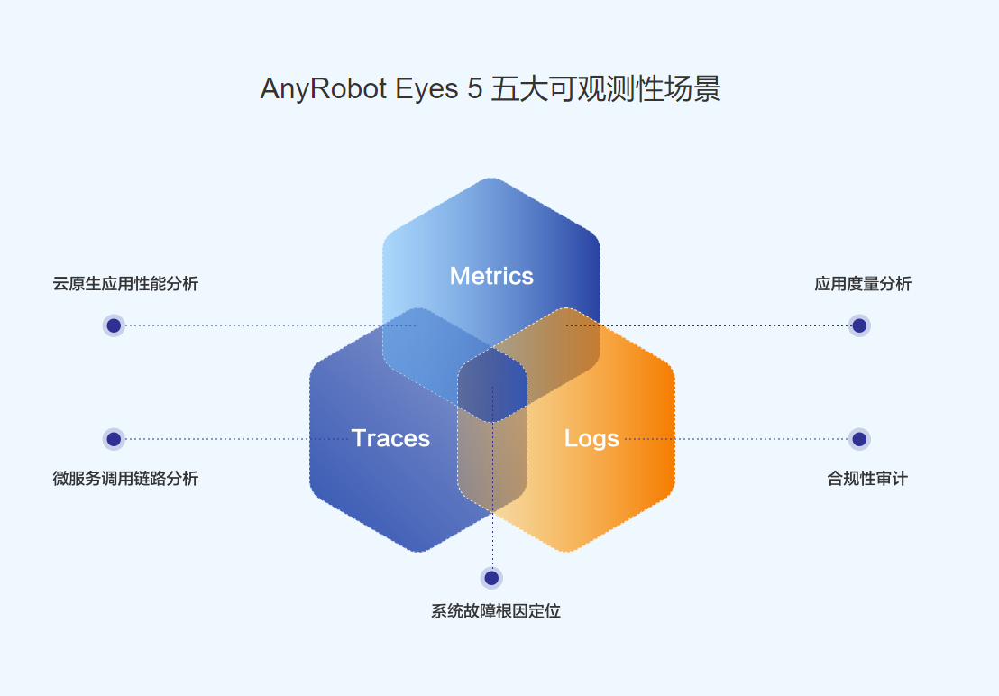

# [TelemetrySDK-Trace(Go)](https://devops.aishu.cn/AISHUDevOps/AnyRobot/_git/Eyes_Docs?path=%2F%E5%8F%AF%E8%A7%82%E6%B5%8B%E6%80%A7%E5%BC%80%E5%8F%91%E8%80%85%E6%8C%87%E5%8D%97%2FTelemetrySDK%E5%BC%80%E5%8F%91%E8%80%85%E6%8C%87%E5%8D%97%2FTrace%2FGo&version=GBdevelop)

`Trace`是可观测性建设中的分布式链路追踪环节。本文档旨在介绍分布式链路追踪的相关概念，同时指导用户使用`TelemetrySDK-Exporter(Go)`
在Go语言编写的业务代码中完成埋点操作，并将生产的链路数据上报到AnyRobot来建设可观测性能力。

### [术语定义](./docs/glossary.md)

### [开发指南](./docs/dev_guide.md)

### [使用手册](./docs/manual.md)
