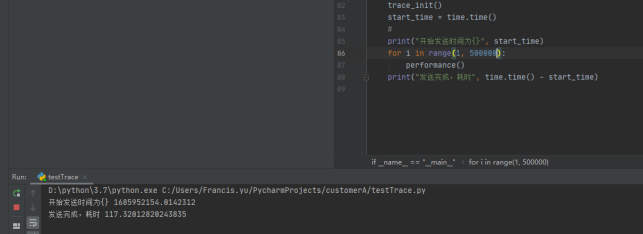

### 模拟真实场景性能测试

#### 发送anyrobot性能测试

测试用例：https://devops.aishu.cn/AISHUDevOps/AnyRobot/_testPlans/execute?planId=400838&suiteId=400898

性能测试：发送anyrobot性能测试

说明：

1. 测试应用A， http for循环创建50万条span数据（2KB/Span）
2. 记录创建50万条数据发送完成需要多长时间

结论：

1. 发送性能较差，117秒可发送50万条数据（go语言是 3.2秒）
2. TPS为4273span/秒，由于是同步发送，所以每一条span会拖累业务代码0.23毫秒
3. 并且需要如下图修改默认配置，不然数据太多会被丢弃
4. 修改配置后发送，没有数据丢失

解决方案：

如图修改provider的配置，提高队列大小等，但是相应的会增加等量的内存占用，需要用户自行判断。 修改默认配置图：

#### 发送标准输出性能测试

说明：

1. 测试应用A， http for循环创建50万条span数据（2KB/Span）
2. 记录创建50万条数据发送完成需要多长时间

结论：

1. 发送性能较差，105秒可发送50万条数据
2. TPS为4761span/秒
3. 无数据丢失

