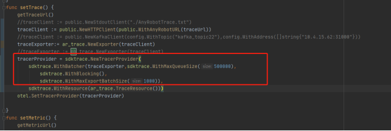
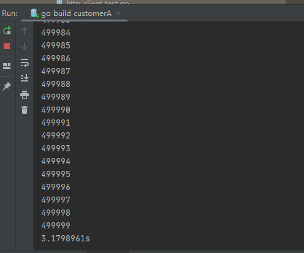
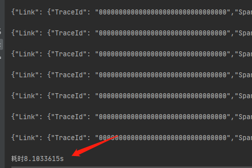
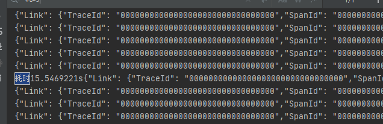
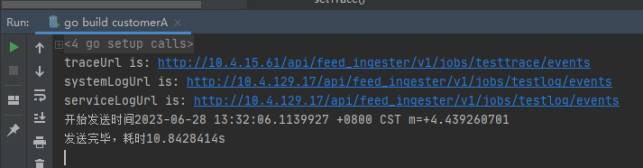

## 性能数据参考

## Golang

### Trace(Go)

### 模拟真实场景性能测试

#### 发送anyrobot性能测试

测试用例：https://devops.aishu.cn/AISHUDevOps/AnyRobot/_testPlans/execute?planId=238213&suiteId=244237

性能测试：发送anyrobot性能测试

说明：

1. 测试应用A， http for循环创建50万条span数据（2KB/Span）
2. 记录创建50万条数据发送完成需要多长时间

结论：

1. 发送性能非常强，3秒即可发送50万条数据，但是数据接收器无法承受，所以最终48万条数据丢失了，只有2万条数据成功写入opensearch
2. 并且需要如下图修改默认配置，不然数据太多会被丢弃
3. 修改配置后发送，没有数据丢失

解决方案：

如图修改provider的配置，提高队列大小等，但是相应的会增加等量的内存占用，需要用户自行判断。 修改默认配置图：

### Log(Go)

### 模拟真实场景性能测试

说明：

1. Golang原生标准输出打印5万条日志字符串
2. TelemetrySDK控制台打印5万条日志

结论：

1. fmt.Println性能结果： 耗时：8.1秒
2. Golang-logger性能结果：耗时：15.5秒
3. TelemetrySDK-Log(Golang)与print作为对比，性能差距一倍，测试通过

### 发送anyrobot性能测试

说明：

1. 生产5万条日志并上报AnyRobot

结论：

1. 生产5万条日志数据并上报AnyRobot，共耗时10.8秒。平均4629条日志/秒
2. 每条日志会阻塞业务系统0.21毫秒
3. 无日志丢失，无日志重复

