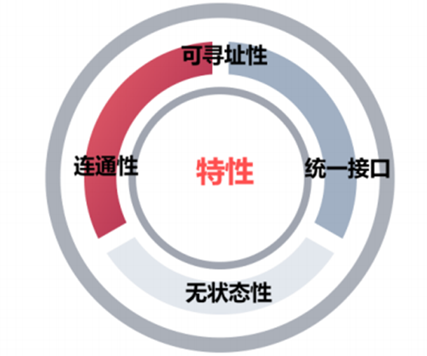
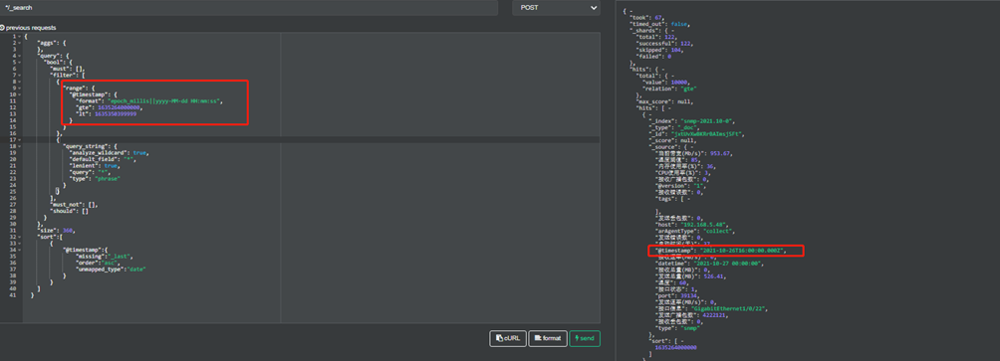
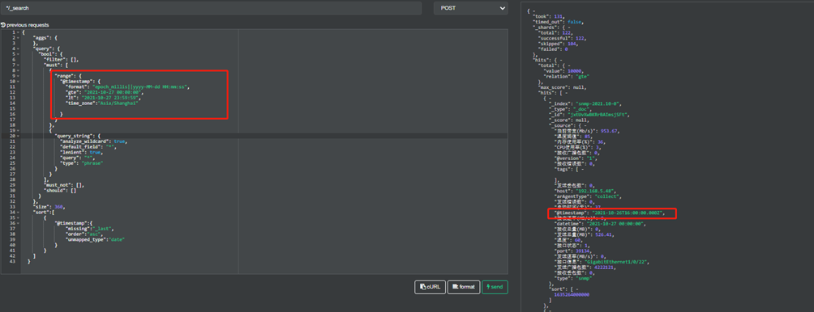
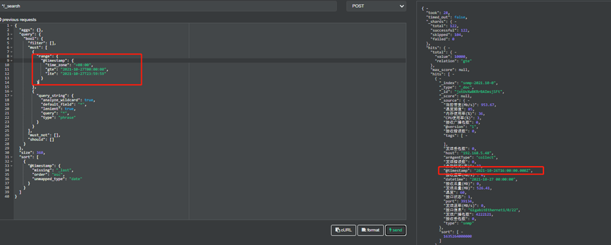
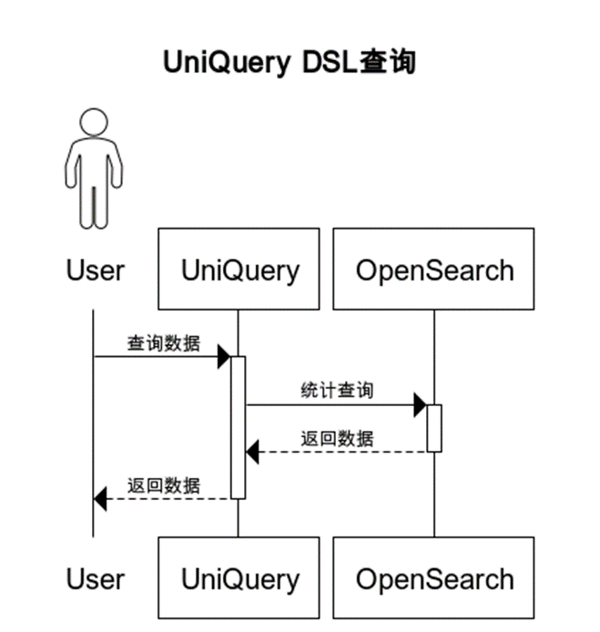
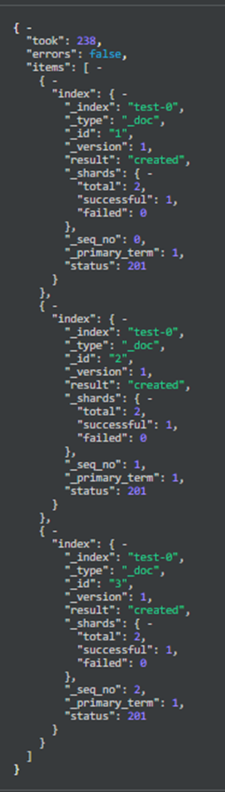

# Uniquery

# 第1章 背景

AnyRobot Eyes 提供从数据生成、数据采集到数据解析、数据查询一系列组件，帮助实现服务的可观测性。本文档旨在讲解如何使用数据查询组件UniQuery。

# 第2章 统一查询UniQuery

## 2.1 技术原理

### 2.1.1 概览

UniQuery是一个基于OpenSearch的查询服务，为用户提供结构化、非结构化文本的多条件检索、统计、分析服务，支持多种接口协议，有限兼容OpenSearch的原生接口。

OpenSearch是一个基于Lucene的分布式开源搜索和分析引擎，起初源于ElasticSearch7.10.2的开源分支，在目前的版本中完全兼容ElasticSearch。

### 2.1.2 相关技术

#### 2.1.2.1 HTTPS

##### 定义

HTTPS协议是由HTTP加上TLS/SSL协议构建的可进行加密传输、身份认证的网络协议，主要通过数字证书、加密算法、非对称密钥等技术完成互联网数据传输加密，实现互联网传输安全保护。

##### 优点

+ 数据保密性：保证数据内容在传输的过程中不会被第三方查看；
+ 数据完整性：及时发现被第三方篡改的传输内容；
+ 数据完整性：及时发现被第三方篡改的传输内容。

##### 常用方法

|方法|说明|
| ----- | ----- |
|GET|GET请求用于从服务端获取关于资源的信息。这些信息将以报头（headers）和表示（representation）的形式返回给客户端；客户端在发送GET请求时不需提供表示（representation）|
|POST|POST请求的作用是为已有资源创建一个从属资源。这里的已有资源，可以是新建资源在数据结构意义上的父资源（就像树根与树叶的关系），也可以是一个专门用于生成其他资源的“工厂（factory）”资源。POST请求所携带的表示（representation）描述了该新资源的初始状态|
|PUT|PUT请求用于设定资源状态。客户端通常会在发送PUT请求时提供一个表示，服务器将根据此表示来创建或修改资源的状态|
|DELETE|DELETE请求用于删除资源。客户端在发送DELETE请求时无需提供表示|
|HEAD|与GET类似，不同点在于HEAD只返回报头、不返回表示（representation）|

##### 状态码

|状态码|作用描述|
| ----- | ----- |
|200-299|成功状态码：服务器已接收到客户端发送的请求，该请求已完成或正在完成|
|300-399|重定向状态码：服务器已接收到客户端发送的请求，但是客户端必须采取进一步的措施才能完成请求。通常包括重定向到其他URL|
|400-499|客户端错误状态码：处理请求时，发生客户端错误，通常是因为客户端未提供正确的参数，无法访问资源或试图执行原本无法执行的操作|
|500-599|服务器错误状态码：服务器已接收到客户端发送的请求，但是服务器在处理请求时发生了错误。这些错误表示服务器出现问题，而不是客户请求出现问题|

#### 2.1.2.2 Restful

##### 定义

+ REST是一种分布式应用的架构风格，也是一种大流量分布式应用的设计方法论；

+ REST是Web本身的架构风格，是设计、开发Web相关规范、Web应用、Web服务的指导原则。

##### 特征



+ 可寻址性：如果一个Web服务将其数据集里有价值部分作为资源（resource）发布出来，那么该应用就是可寻址的（addressable）。即，每个资源的URI（统一资源标识符）是唯一的；
+ 统一接口：客户端与资源之间的所有交互，通过HTTP方法来确定并完成对资源的操作；
+ 无状态性：一个REST式服务从不保存任何客户端在应用中所处状态的信息，服务就会按当前的资源状态（资源的信息）来独立处理各个客户端请求；
+ 连通性：服务器通过资源当前的状态信息给出链接与表单来引导客户端在应用中所处状态的信息的变迁。

#### 2.1.2.3 JSON

##### 定义

ContentBus API HTTP请求及响应body中的参数大部分使用JSON格式，JSON(JavaScript Object Notation)是一种轻量级的数据交换格式。简洁和清晰的层次结构使得JSON成为理想的数据交换语言。易于人阅读和编写，同时也易于机器解析和生成，并有效地提升网络传输效率。

##### 特征

+ 可读性：数据格式比较简单，易于读写；格式压缩，占用带宽较小；

+ 解析难度：易于解析这种语言，客户端JavaScript可以通过 eval() 进行JSON数据的读取；
+ 语言支持：支持多种语言，包括ActionScript，C，C#，ColdFusion，Java，JavaScript，Perl，php，Python，Ruby等语言服务器端语言，便于服务器端的解析；
+ 维护性：JSON格式能够直接为服务器端代码使用，大大简化了服务器端和客户端的代码开发量，但是完成的任务不变，且易于维护。

## 2.2 DSL查询语言

### 2.2.1 定义

领域特定语言（英语：domain-specific language简写为DSL）指的是专注于某个应用程序领域的计算机语言。又译作领域专用语言。不同于普通的跨领域通用计算机语言(GPL)，领域特定语言只用在某些特定的领域。

在OpenSearch中，提供了基于Restful风格的json格式DSL语言来定义查询，功能丰富且具有多种表达形式，能够满足Lucene的绝大部分功能。

1. OpenSearch将查询DSL视为查询的AST（抽象语法树），它由两种子句组成：

+ 叶子查询子句：
  + 叶查询子句中寻找一个特定的值在某一特定领域，如 match，term或 range查询。这些查询可以自己使用。
+ 复合查询子句
  + 复合查询子句包装其他叶查询或复合查询，并用于以逻辑方式组合多个查询（例如 bool或dis\_max查询），或更改其行为（例如 constant\_score查询）。查询子句的行为会有所不同，具体取决于它们是在 查询上下文中还是在过滤器上下文中使用。

2. 查询支持两种类型：

+ 过滤查询
  + 查询结构如下：

```json
{
       "query": {
              "bool": {
                     "must": {},
                     "filter": {},
                     "must_not": {},
                     "should": {},
                     "minimum_should_match": {}
              }
       }
}
```

+ 结构说明：

|键|类型|含义|
| ----- | ----- | ----- |
|query|json|定义过滤查询语句|
|bool|json|定义布尔查询|
|must|json/array(object)|定义必须匹配的条件, 等同于AND，可为数组或者json格式的单个条件,该请求包含文档匹配度评分机制|
|must\_not|json/array(object)|定义必须不匹配的条件, 等同于NOT，可为数组或者json格式的单个条件|
|filter|json/array(object)|定义必须匹配的条件,等同于AND，可为数组或者json格式的单个条件，该请求不包含文档评分机制。|
|should|json/array(object)|定义可匹配的条件|
|minimum\_should\_match|number|定义should条件中需要匹配的条件个数|

+ 条件查询示例

以下{field\_name}都代表需要查询的属性名称，根据日志结构定义。

      * 时间范围过滤：

```json
{
    "range":{
        {field_name}:{
            "format":"epoch_millis||yyyy-MM-dd HH:mm:ss",
            "gte":"2021-07-01T01:49:10.893Z",
            "lt":"2021-07-08T01:49:10.893Z"
        }
    }
}
```

Ÿ  format：指定时间解析的字符串格式，以上述为例，代表gte和lt中的时间字符串以format中的格式解析，与存储的字段格式无关；

Ÿ  gte：开始的时间，包含边界；

Ÿ  lt：结束的时间，不包含边界，若需要包含边界，可改为lte。

      * 数值范围过滤：

```json
{
    "range":{
        {field_name}:{
            "gte":20,              //{value_name}的范围上界，包含边界
            "lt":40                //{value_name}的范围下界，不包含边界
        }
    }
}
```

      * 字段值过滤：

Match：模糊查询，通常用于对text类型字段的查询,会对进行查询的文本先进行分词操作；


Term：精确查询，通常用于对keyword和有精确值的字段进行查询,不会对进行查询的文本进行分词操作


说明：{value}代表为字段过滤的值。

      * 单值过滤

```json
{
    "term":{
        {field_name}:{value}
    }
}
{
    "match":{
        {field_name}:{value}
    }
}
```

      * 多值过滤

```json
{
    "terms":{
        {field_name}:[{value1},{value2}]
    }
}
```

说明：若field为字符串类型，想要精确查询，需要加“.keyword”后缀。

      * 字段存在查询

```json
{
    "exists": {
      "field": {field_name}
    }
 }
```

+ 聚合查询
  + 查询结构

结构如下：

      * 单层聚合：

```json
{
    "aggs":{
        <agg_name1>:{}
    }
}
```

      * 多层聚合：

```json
{
    "aggs":{
        <agg_name1>:{
            "aggs":{
                <agg_name2>:{}
            }
        }
    }
}
```

|键|类型|含义|
| ----- | ----- | ----- |
|aggs|json|定义聚合查询语句|
|<agg\_name>|json|聚合查询桶名称，自定义|

+ 聚合查询示例---<agg\_name>内的语句定义
  + 统计计数

|键|类型|含义|
| ----- | ----- | ----- |
|terms|json|定义统计计数查询|
|order|json|定义排序规则，默认以文档数（doc\_count）倒序排序|
|field|string|定义聚合字段|
|shard\_size|number|定义分片级别的返回top值|
|size|number|定义返回top值|

示例：

```json
{
  "aggs": {
    <agg_name>: {
      "terms": {
        "field":<field_name>,
        "order": {
          "_count": "desc"      //此处为默认值，_count代表文档数即doc_count
        },
        "shard_size": 200,
        "size": 100
      }
    }
  }
```

      * 时间直方图：

|键|类型|含义|
| ----- | ----- | ----- |
|date\_histogram|json|定义时间直方图聚合|
|field|string|定义聚合字段|
|calendar\_interval|string|日历时间间隔|
|fixed\_interval|string|固定时间间隔|
|interval|string|时间间隔|
|time\_zone|string|时区，不指定则默认UTC|
|min\_doc\_count|number|返回桶文档数最小数量，默认会返回全部|
|order|json|定义排序规则，默认为时间倒叙排序|

说明：

+ calendar\_interval：日历时间间隔，支持minute/1m、hour/1h、day/1d、week/1w、month/1M、quarter/1q、year/1y
+ fixed\_interval：固定时间间隔，支持ms、s、m、h、d
+ interval：时间间隔，支持日历和固定时间格式，但在未来可能会被删除
+ order：排序若想为文档数排序，定义和统计计数中一致

示例：

```json
{
    "date_histogram": {
        "field": "@timestamp",
        "fixed_interval": "2d",
        "min_doc_count": 1,
        "time_zone": "Asia/Shanghai",
        "order": {
            "_count": "desc"
        }
    }
}
```

      * top\_hits聚合

|键|类型|含义|
| ----- | ----- | ----- |
|top\_hits|json|定义top\_hits聚合|
|size|number|定义返回top数量|
|sort|json|定义排序规则|
|\_source|json|定义此处为自定义字段的设置|
|include|array|定义返回的字段|

示例：

```json
{
    "top_hits":{
        "size":1,
        "sort":[
            {
                "@timestamp":"desc"
            }
        ],
        "_source":{
            "includes":[
                "共享地址url",
                "共享地址类型",
                "名称"
            ]
        }
    }
}
```

+ 查询时区说明

查询返回的时间：存储格式即返回格式，根据解析规则定义时间字段的解析格式，若指定为UTC时间，则存储就是UTC时间，数据返回也是UTC时间字符串。

查询的时间：查询时指定时间分为两种

      1. 时间范围过滤查询，返回指定时间范围内的数据
      2.  聚合查询---时间直方图，将时间按指定间隔进行分桶

+ 时间范围过滤

```json
{
    "range":{
        {field_name}:{
            "format":"epoch_millis||yyyy-MM-dd HH:mm:ss",
            "gte":"2021-07-01T01:49:10.893Z",
            "lt":"2021-07-08T01:49:10.893Z"
        }
    }
}
```

+ 时间说明：建议使用如示例中的UTC时间字符串或者时间戳进行查询，若想使用本地时间，需加参数“time\_zone”,例如上海本地时间，"time\_zone":"Asia/shanghai"
+ 支持时区和UTC偏移量

如图：查询结果一致。







+ 聚合时间直方图

```json
{
    "date_histogram": {
        "field": "@timestamp",
        "fixed_interval": "2d",
        "min_doc_count": 1,
        "time_zone": "Asia/Shanghai",
        "order": {
            "_count": "desc"
        }
    }
}
```

+ 时区参数：”time\_zone”

这里使用时区时，返回的分桶时间字段的key值将会按此时区转换返回，默认存储为UTC时间，转换也是按UTC时间完成。

例如，存储为”2016-12-01T00:00:00.000Z”,查询时区为"Asia/Shanghai"，将会返回”2016-12-01T00:00:00.000+8:00”。

### 2.2.2 API文档

#### 2.2.2.1 Search查询接口

```Plain Text
URL：/api/uniquery/v1/dsl/{x_library}/_search
```

+ 请求方式：POST

+ 内容格式：JSON
+ URL路径参数：

|参数|是否必填|类型|说明|
| ----- | ----- | ----- | ----- |
|x\_library|否|string|索引库名称，扩展参数，也可放于body中，都为空则默认返回空数据集，若两个都有，则取交集查询|

+ 请求参数：

|参数|是否必填|类型|说明|
| ----- | ----- | ----- | ----- |
|scroll|否|string|指定搜索为滚动分页查询，保留分页搜索上下文的有效时间（支持数字+时间单位s,m,h）最长不超过24h|

+ 请求体参数：

|参数|是否必填|类型|说明|
| ----- | ----- | ----- | ----- |
|x\_library|否|array|该参数为dsl之外的扩展参数，指定查询的索引库名称，和路径中一致，非必须参数，若路径和body中均无此参数，则默认空数据集返回，若两个都有，则取交集查询|

+ 返回结果：

返回为OpenSearch的原生接口返回内容，为json格式。

#### 2.2.2.2 Scroll滚动分页接口

URL：/api/uniquery/v1/dsl/\_search/scroll

+ 请求方式：POST
+ 内容格式：JSON
+ 请求头参数：

|参数|是否必填|类型|说明|
| ----- | ----- | ----- | ----- |
|Authorization|否|string|认证信息BearerToken|

+ 请求体参数：

|参数|是否必填|类型|说明|
| ----- | ----- | ----- | ----- |
|scroll|否|string|为本次请求保留分页搜索上下文的有效时间（支持数字+时间单位s,m,h），最长不超过24h|
|scroll\_id|是|string|分页查询id|

+ 返回结果：

返回为OpenSearch的原生接口返回内容，为json格式。

#### 2.2.2.3 Count总数查询接口

+ URL：/api/uniquery/v1/dsl/{x\_library}/\_count

+ 请求方式：POST
+ 内容格式：JSON
+ URL路径参数：

|参数|是否必填|类型|说明|
| ----- | ----- | ----- | ----- |
|x\_library|否|string|索引库名称，扩展参数，也可放于body中，都为空则默认返回空数据集，若两个都有，则取交集查询|

+ 请求体参数：

|参数|是否必填|类型|说明|
| ----- | ----- | ----- | ----- |
|x\_library|否|array|该参数为dsl之外的扩展参数，指定查询的索引库名称，和路径中一致，非必须参数，若路径和body中均无此参数，则默认空数据集返回，若两个都有，则取交集查询|

+ 返回结果：

返回为OpenSearch的原生接口返回内容，为json格式。

windows系统下可打开以下文件查看更多详细示例：

### 2.2.3 开发与实践

#### 2.2.3.1 调用流程

调用过程如下图所示：



#### 2.2.3.2 请求示例

**第1步****   **往opensearch/es写入test类型数据：

```json
curl -X POST "localhost:9200/_bulk?pretty" -H 'Content-Type: application/json' -d'
{ "index" : { "_id" : "1" } }
{ "type" :"test","@timestamp":"2021-01-08T15:00:02.059158Z","operation": "create","description": "用户“张三”新建文件“产品资料/产品白皮书1.pdf”。","target_object": {"type": "file","id": "gns://D42F2729C56E489A948985D4E75C5813/EC3264CCC61D4560BD92C1D1411FD691","path": "产品资料/产品白皮书1.pdf","size": 12815410,"doc_lib": {"id": "gns://D42F2729C56E489A948985D4E75C5810","type": "department_doc_lib1"}}}
{ "index" : { "_id" : "2" } }
{"type":"test","@timestamp":"2021-08-18T15:00:02.059158Z","operation": "delete","description": "用户“张三”新建文件“产品资料/产品白皮书2.pdf”。","target_object": {"type": "file","id": "gns://D42F2729C56E489A948985D4E75C5813/EC3264CCC61D4560BD92C1D1411FD692","path": "产品资料/产品白皮书2.pdf","size": 12815408,"doc_lib": {"id": "gns://D42F2729C56E489A948985D4E75C5811","type": "department_doc_lib2"}}}
{ "index" : { "_id" : "3" } }
{"type":"test","@timestamp":"2021-04-08T15:10:02.059158Z","operation": "rename","description": "用户“张三”新建文件“产品资料/产品白皮书3.pdf”。","target_object": {"type": "file","id": "gns://D42F2729C56E489A948985D4E75C5813/EC3264CCC61D4560BD92C1D1411FD693","path": "产品资料/产品白皮书3.pdf","size": 12815318,"doc_lib": {"id": "gns://D42F2729C56E489A948985D4E75C5812","type": "department_doc_lib3"}}}
{ "index" : { "_id" : "4" } }
{"type":"test","@timestamp":"2021-04-08T15:20:02.059158Z","operation": "rename","description": "用户“张三”新建文件“产品资料/产品白皮书1.pdf”。","target_object": {"type": "file","id": "gns://D42F2729C56E489A948985D4E75C5813/EC3264CCC61D4560BD92C1D1411FD691","path": "产品资料/产品白皮书1.pdf","size": 12815318,"doc_lib": {"id": "gns://D42F2729C56E489A948985D4E75C5810","type": "department_doc_lib1"}}}
{ "index" : { "_id" : "5" } }
{"type":"test","@timestamp":"2021-04-08T15:00:02.059158Z","operation": "create","description": "用户“张三”新建文件“产品资料/产品白皮书4.pdf”。","target_object": {"type": "file","id": "gns://D42F2729C56E489A948985D4E75C5813/EC3264CCC61D4560BD92C1D1411FD694","path": "产品资料/产品白皮书4.pdf","size": 12815318,"doc_lib": {"id": "gns://D42F2729C56E489A948985D4E75C5813","type": "department_doc_lib4"}}}
{ "index" : { "_id" : "6" } }
{"type":"test","@timestamp":"2021-04-08T16:00:02.059158Z","operation": "rename","description": "用户“张三”新建文件“产品资料/产品白皮书4.pdf”。","target_object": {"type": "file","id": "gns://D42F2729C56E489A948985D4E75C5813/EC3264CCC61D4560BD92C1D1411FD694","path": "产品资料/产品白皮书4.pdf","size": 12815318,"doc_lib": {"id": "gns://D42F2729C56E489A948985D4E75C5813","type": "department_doc_lib4"}}}
```

**第2步****   **返回结果如图为200，则写入成功。



由数据结构设计可知，该数据类型为test，则索引库名称为test。

##### Search查询

+ url

ip:port：为能够通信UniQuery服务的地址和端口号

```Plain Text
http://ip:port/api/uniquery/v1/dsl/test /_search
```

+ Body

查询场景如下：每月为间隔时间，统计每个文档库类型下用户执行的操作，并且对操作进行统计计数。

```json
{
  "size":0,
  "aggs": {
    "1": {
      "date_histogram": {
        "field": "@timestamp",
        "calendar_interval": "1M",
        "min_doc_count":1,
        "time_zone":"Asia/Shanghai"
      },
      "aggs":{
          "2":{
              "terms":{
                  "field":"target_object.doc_lib.type.keyword"
              },
              "aggs":{
                  "3":{
                      "terms":{
                          "field":"operation.keyword"
                      }
                  }
              }
          }
      }
    }
  }
}
```

+ 结果如下：

```json
{
    "took": 4,
    "timed_out": false,
    "_shards": {
        "total": 1,
        "successful": 1,
        "skipped": 0,
        "failed": 0
    },
    "hits": {
        "total": {
            "value": 6,
            "relation": "eq"
        },
        "max_score": null,
        "hits": []
    },
    "aggregations": {
        "1": {
            "buckets": [
                {
                    "key_as_string": "2021-01-01T00:00:00.000+08:00",
                    "key": 1609430400000,
                    "doc_count": 1,
                    "2": {
                        "doc_count_error_upper_bound": 0,
                        "sum_other_doc_count": 0,
                        "buckets": [
                            {
                                "key": "department_doc_lib1",
                                "doc_count": 1,
                                "3": {
                                    "doc_count_error_upper_bound": 0,
                                    "sum_other_doc_count": 0,
                                    "buckets": [
                                        {
                                            "key": "create",
                                            "doc_count": 1
                                        }
                                    ]
                                }
                            }
                        ]
                    }
                },
                {
                    "key_as_string": "2021-04-01T00:00:00.000+08:00",
                    "key": 1617206400000,
                    "doc_count": 4,
                    "2": {
                        "doc_count_error_upper_bound": 0,
                        "sum_other_doc_count": 0,
                        "buckets": [
                            {
                                "key": "department_doc_lib4",
                                "doc_count": 2,
                                "3": {
                                    "doc_count_error_upper_bound": 0,
                                    "sum_other_doc_count": 0,
                                    "buckets": [
                                        {
                                            "key": "create",
                                            "doc_count": 1
                                        },
                                        {
                                            "key": "rename",
                                            "doc_count": 1
                                        }
                                    ]
                                }
                            },
                            {
                                "key": "department_doc_lib1",
                                "doc_count": 1,
                                "3": {
                                    "doc_count_error_upper_bound": 0,
                                    "sum_other_doc_count": 0,
                                    "buckets": [
                                        {
                                            "key": "rename",
                                            "doc_count": 1
                                        }
                                    ]
                                }
                            },
                            {
                                "key": "department_doc_lib3",
                                "doc_count": 1,
                                "3": {
                                    "doc_count_error_upper_bound": 0,
                                    "sum_other_doc_count": 0,
                                    "buckets": [
                                        {
                                            "key": "rename",
                                            "doc_count": 1
                                        }
                                    ]
                                }
                            }
                        ]
                    }
                },
                {
                    "key_as_string": "2021-08-01T00:00:00.000+08:00",
                    "key": 1627747200000,
                    "doc_count": 1,
                    "2": {
                        "doc_count_error_upper_bound": 0,
                        "sum_other_doc_count": 0,
                        "buckets": [
                            {
                                "key": "department_doc_lib2",
                                "doc_count": 1,
                                "3": {
                                    "doc_count_error_upper_bound": 0,
                                    "sum_other_doc_count": 0,
                                    "buckets": [
                                        {
                                            "key": "delete",
                                            "doc_count": 1
                                        }
                                    ]
                                }
                            }
                        ]
                    }
                }
            ]
        }
    }
}
```

##### Scroll查询请求示例

**第1步****   **发送dsl请求；

+ url

ip:port：为能够通信UniQuery服务的地址和端口号

```Plain Text
http://ip:port/api/uniquery/v1/dsl/test /_search?scroll=1m
```

+ Body

查询场景如下：获取test库下创建操作的事件

```json
{
  "query":{
      "bool":{
          "filter":{
              "term":{
                  "operation":"create"
              }
          }
      }
  }
}
```

+ 结果如下：

```json
{
    "_scroll_id": "FGluY2x1ZGVfY29udGV4dF91dWlkDXF1ZXJ5QW5kRmV0Y2gBFnVTazZRNzMzU3RXcGNFY2lkU0pmX0EAAAAAAD1J2hY3VC1YSnF6VlJOT084cVZiY1pCdG1B",
    "took": 1,
    "timed_out": false,
    "_shards": {
        "total": 1,
        "successful": 1,
        "skipped": 0,
        "failed": 0
    },
    "hits": {
        "total": {
            "value": 2,
            "relation": "eq"
        },
        "max_score": 0.0,
        "hits": [
            {
                "_index": "test-0",
                "_type": "_doc",
                "_id": "1",
                "_score": 0.0,
                "_source": {
                    "type": "test",
                    "@timestamp": "2021-01-08T15:00:02.059158Z",
                    "operation": "create",
                    "description": "用户“张三”新建文件“产品资料/产品白皮书1.pdf”。",
                    "target_object": {
                        "type": "file",
                        "id": "gns://D42F2729C56E489A948985D4E75C5813/EC3264CCC61D4560BD92C1D1411FD691",
                        "path": "产品资料/产品白皮书1.pdf",
                        "size": 12815410,
                        "doc_lib": {
                            "id": "gns://D42F2729C56E489A948985D4E75C5810",
                            "type": "department_doc_lib1"
                        }
                    }
                }
            },
            {
                "_index": "test-0",
                "_type": "_doc",
                "_id": "5",
                "_score": 0.0,
                "_source": {
                    "type": "test",
                    "@timestamp": "2021-04-08T15:00:02.059158Z",
                    "operation": "create",
                    "description": "用户“张三”新建文件“产品资料/产品白皮书4.pdf”。",
                    "target_object": {
                        "type": "file",
                        "id": "gns://D42F2729C56E489A948985D4E75C5813/EC3264CCC61D4560BD92C1D1411FD694",
                        "path": "产品资料/产品白皮书4.pdf",
                        "size": 12815318,
                        "doc_lib": {
                            "id": "gns://D42F2729C56E489A948985D4E75C5813",
                            "type": "department_doc_lib4"
                        }
                    }
                }
            }
        ]
    }
}
```

**第2步****   **发送scroll请求

+ url：

```Plain Text
http://ip:port /api/search/v1/dsl/test/_search?scroll=1m
```

+ Body：

```json
{
  "scroll_id": "FGluY2x1ZGVfY29udGV4dF91dWlkDXF1ZXJ5QW5kRmV0Y2gBFnVTazZRNzMzU3RXcGNFY2lkU0pmX0EAAAAAAD1J2xY3VC1YSnF6VlJOT084cVZiY1pCdG1B"
}
```

+ 结果如下：

由于只有两条数据，所以第二次获取为空数据集

```json
{
    "took": 55,
    "timed_out": false,
    "_shards": {
        "total": 1,
        "successful": 1,
        "skipped": 0,
        "failed": 0
    },
    "hits": {
        "total": {
            "value": 2,
            "relation": "eq"
        },
        "max_score": 0.0,
        "hits": []
    }
}
```

##### Count查询

+ url

ip:port：为能够通信UniQuery服务的地址和端口号

```Plain Text
http://ip:port/api/uniquery/v1/dsl/test /_count
```

+ Body

查询场景如下：统计文档总数

```json
{
  "query":{
       “match_all”: {}
  }
}
```

+ 结果如下：

```json
{
    "count": 6,
    "_shards": {
        "total": 1,
        "successful": 1,
        "skipped": 0,
        "failed": 0
    }
}
```

## 2.3 限制与兼容性

### 2.3.1 部署要求

+ 容器部署依赖：Proton CS 1.1.0+

+ CPU架构依赖：amd64、arm64

### 2.3.2 兼容性

+ 语法上兼容ElasticSearch7.10查询语法

+ 版本上兼容AnyRobot-3.X

# 第3章 术语及参考文献

## 3.1 术语说明

|中文简体|中文繁体|英文|注释|
| ----- | ----- | ----- | ----- |
|\-|\-|RESTful API|一种分布式应用的架构风格，也是一种大流量分布式应用的设计方法论|
|超文本传输协议|超文本傳輸協議|HTTP|网络通信中的应用层协议|
|超文本传输安全协议|超文本傳輸安全協議|HTTPS|由 SSL+HTTP 协议构建的可进行加密传输、身份认证的网络协议，要比HTTP协议安全，可防止数据在传输过程中被窃取、改变，确保数据的完整性|
|\-|\-|DSL|领域特定语言（英语：domain-specific   language、DSL）指的是专注于某个应用程序领域的计算机语言|
|\-|\-|JSON|JSON（JavaScript   Object Notation, JS 对象简谱）是一种轻量级的数据交换格式。它基于 ECMAScript (欧洲计算机协会制定的js规范)的一个子集，采用完全独立于编程语言的文本格式来存储和表示数据|
