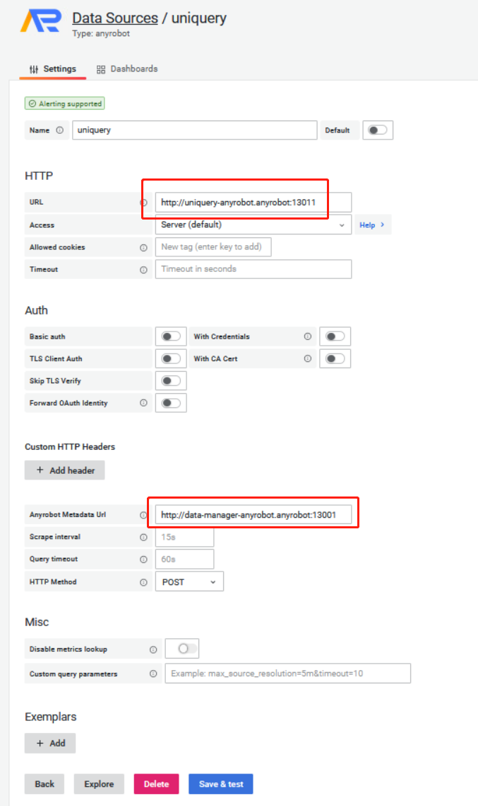

# Uniquery

# 第1章 背景

AnyRobot Eyes 提供从数据生成、数据采集到数据解析、数据查询一系列组件，帮助实现服务的可观测性。本文档旨在讲解如何使用数据查询组件UniQuery。

# 第2章 统一查询UniQuery

## 2.1 技术原理

### 2.1.1 概览

UniQuery是一个基于OpenSearch的查询服务，为用户提供结构化、非结构化文本的多条件检索、统计、分析服务，支持多种接口协议，有限兼容OpenSearch的原生接口。

OpenSearch是一个基于Lucene的分布式开源搜索和分析引擎，起初源于ElasticSearch7.10.2的开源分支，在目前的版本中完全兼容ElasticSearch。

### 2.1.2 相关技术

#### 2.1.2.1 HTTPS

##### 定义

HTTPS协议是由HTTP加上TLS/SSL协议构建的可进行加密传输、身份认证的网络协议，主要通过数字证书、加密算法、非对称密钥等技术完成互联网数据传输加密，实现互联网传输安全保护。

##### 优点

+ 数据保密性：保证数据内容在传输的过程中不会被第三方查看；
+ 数据完整性：及时发现被第三方篡改的传输内容；
+ 数据完整性：及时发现被第三方篡改的传输内容。

##### 常用方法

| 方法   | 说明                                                                                                                                                                                                                                                |
| ------ | --------------------------------------------------------------------------------------------------------------------------------------------------------------------------------------------------------------------------------------------------- |
| GET    | GET请求用于从服务端获取关于资源的信息。这些信息将以报头（headers）和表示（representation）的形式返回给客户端；客户端在发送GET请求时不需提供表示（representation）                                                                                   |
| POST   | POST请求的作用是为已有资源创建一个从属资源。这里的已有资源，可以是新建资源在数据结构意义上的父资源（就像树根与树叶的关系），也可以是一个专门用于生成其他资源的“工厂（factory）”资源。POST请求所携带的表示（representation）描述了该新资源的初始状态 |
| PUT    | PUT请求用于设定资源状态。客户端通常会在发送PUT请求时提供一个表示，服务器将根据此表示来创建或修改资源的状态                                                                                                                                          |
| DELETE | DELETE请求用于删除资源。客户端在发送DELETE请求时无需提供表示                                                                                                                                                                                        |
| HEAD   | 与GET类似，不同点在于HEAD只返回报头、不返回表示（representation）                                                                                                                                                                                   |

##### 状态码

| 状态码  | 作用描述                                                                                                                               |
| ------- | -------------------------------------------------------------------------------------------------------------------------------------- |
| 200-299 | 成功状态码：服务器已接收到客户端发送的请求，该请求已完成或正在完成                                                                     |
| 300-399 | 重定向状态码：服务器已接收到客户端发送的请求，但是客户端必须采取进一步的措施才能完成请求。通常包括重定向到其他URL                      |
| 400-499 | 客户端错误状态码：处理请求时，发生客户端错误，通常是因为客户端未提供正确的参数，无法访问资源或试图执行原本无法执行的操作               |
| 500-599 | 服务器错误状态码：服务器已接收到客户端发送的请求，但是服务器在处理请求时发生了错误。这些错误表示服务器出现问题，而不是客户请求出现问题 |

#### 2.1.2.2 Restful

##### 定义

+ REST是一种分布式应用的架构风格，也是一种大流量分布式应用的设计方法论；

+ REST是Web本身的架构风格，是设计、开发Web相关规范、Web应用、Web服务的指导原则。

##### 特征


+ 可寻址性：如果一个Web服务将其数据集里有价值部分作为资源（resource）发布出来，那么该应用就是可寻址的（addressable）。即，每个资源的URI（统一资源标识符）是唯一的；
+ 统一接口：客户端与资源之间的所有交互，通过HTTP方法来确定并完成对资源的操作；
+ 无状态性：一个REST式服务从不保存任何客户端在应用中所处状态的信息，服务就会按当前的资源状态（资源的信息）来独立处理各个客户端请求；
+ 连通性：服务器通过资源当前的状态信息给出链接与表单来引导客户端在应用中所处状态的信息的变迁。

#### 2.1.2.3 JSON

##### 定义

ContentBus API HTTP请求及响应body中的参数大部分使用JSON格式，JSON(JavaScript Object Notation)是一种轻量级的数据交换格式。简洁和清晰的层次结构使得JSON成为理想的数据交换语言。易于人阅读和编写，同时也易于机器解析和生成，并有效地提升网络传输效率。

##### 特征

+ 可读性：数据格式比较简单，易于读写；格式压缩，占用带宽较小；

+ 解析难度：易于解析这种语言，客户端JavaScript可以通过 eval() 进行JSON数据的读取；
+ 语言支持：支持多种语言，包括ActionScript，C，C#，ColdFusion，Java，JavaScript，Perl，php，Python，Ruby等语言服务器端语言，便于服务器端的解析；
+ 维护性：JSON格式能够直接为服务器端代码使用，大大简化了服务器端和客户端的代码开发量，但是完成的任务不变，且易于维护。

## 2.2 DSL查询语言

### 2.2.1 定义

领域特定语言（英语：domain-specific language简写为DSL）指的是专注于某个应用程序领域的计算机语言。又译作领域专用语言。不同于普通的跨领域通用计算机语言(GPL)，领域特定语言只用在某些特定的领域。

在OpenSearch中，提供了基于Restful风格的json格式DSL语言来定义查询，功能丰富且具有多种表达形式，能够满足Lucene的绝大部分功能。

1. OpenSearch将查询DSL视为查询的AST（抽象语法树），它由两种子句组成：

+ 叶子查询子句：
  + 叶查询子句中寻找一个特定的值在某一特定领域，如 match，term或 range查询。这些查询可以自己使用。
+ 复合查询子句
  + 复合查询子句包装其他叶查询或复合查询，并用于以逻辑方式组合多个查询（例如 bool或dis\_max查询），或更改其行为（例如 constant\_score查询）。查询子句的行为会有所不同，具体取决于它们是在 查询上下文中还是在过滤器上下文中使用。

2. 查询支持两种类型：

+ 过滤查询
  + 查询结构如下：

```json
{
       "query": {
              "bool": {
                     "must": {},
                     "filter": {},
                     "must_not": {},
                     "should": {},
                     "minimum_should_match": {}
              }
       }
}
```

+ 结构说明：

| 键                     | 类型               | 含义                                                                                       |
| ---------------------- | ------------------ | ------------------------------------------------------------------------------------------ |
| query                  | json               | 定义过滤查询语句                                                                           |
| bool                   | json               | 定义布尔查询                                                                               |
| must                   | json/array(object) | 定义必须匹配的条件, 等同于AND，可为数组或者json格式的单个条件,该请求包含文档匹配度评分机制 |
| must\_not              | json/array(object) | 定义必须不匹配的条件, 等同于NOT，可为数组或者json格式的单个条件                            |
| filter                 | json/array(object) | 定义必须匹配的条件,等同于AND，可为数组或者json格式的单个条件，该请求不包含文档评分机制。   |
| should                 | json/array(object) | 定义可匹配的条件                                                                           |
| minimum\_should\_match | number             | 定义should条件中需要匹配的条件个数                                                         |

+ 条件查询示例

以下{field\_name}都代表需要查询的属性名称，根据日志结构定义。

      * 时间范围过滤：

```json
{
    "range":{
        {field_name}:{
            "format":"epoch_millis||yyyy-MM-dd HH:mm:ss",
            "gte":"2021-07-01T01:49:10.893Z",
            "lt":"2021-07-08T01:49:10.893Z"
        }
    }
}
```

Ÿ  format：指定时间解析的字符串格式，以上述为例，代表gte和lt中的时间字符串以format中的格式解析，与存储的字段格式无关；

Ÿ  gte：开始的时间，包含边界；

Ÿ  lt：结束的时间，不包含边界，若需要包含边界，可改为lte。

      * 数值范围过滤：

```json
{
    "range":{
        {field_name}:{
            "gte":20,              //{value_name}的范围上界，包含边界
            "lt":40                //{value_name}的范围下界，不包含边界
        }
    }
}
```

      * 字段值过滤：

Match：模糊查询，通常用于对text类型字段的查询,会对进行查询的文本先进行分词操作；


Term：精确查询，通常用于对keyword和有精确值的字段进行查询,不会对进行查询的文本进行分词操作


说明：{value}代表为字段过滤的值。

      * 单值过滤

```json
{
    "term":{
        {field_name}:{value}
    }
}
{
    "match":{
        {field_name}:{value}
    }
}
```

      * 多值过滤

```json
{
    "terms":{
        {field_name}:[{value1},{value2}]
    }
}
```

说明：若field为字符串类型，想要精确查询，需要加“.keyword”后缀。

      * 字段存在查询

```json
{
    "exists": {
      "field": {field_name}
    }
 }
```

+ 聚合查询
  + 查询结构

结构如下：

      * 单层聚合：

```json
{
    "aggs":{
        <agg_name1>:{}
    }
}
```

      * 多层聚合：

```json
{
    "aggs":{
        <agg_name1>:{
            "aggs":{
                <agg_name2>:{}
            }
        }
    }
}
```

| 键          | 类型 | 含义                   |
| ----------- | ---- | ---------------------- |
| aggs        | json | 定义聚合查询语句       |
| <agg\_name> | json | 聚合查询桶名称，自定义 |

+ 聚合查询示例---<agg\_name>内的语句定义
  + 统计计数

| 键          | 类型   | 含义                                             |
| ----------- | ------ | ------------------------------------------------ |
| terms       | json   | 定义统计计数查询                                 |
| order       | json   | 定义排序规则，默认以文档数（doc\_count）倒序排序 |
| field       | string | 定义聚合字段                                     |
| shard\_size | number | 定义分片级别的返回top值                          |
| size        | number | 定义返回top值                                    |

示例：

```json
{
  "aggs": {
    <agg_name>: {
      "terms": {
        "field":<field_name>,
        "order": {
          "_count": "desc"      //此处为默认值，_count代表文档数即doc_count
        },
        "shard_size": 200,
        "size": 100
      }
    }
  }
```

      * 时间直方图：

| 键                 | 类型   | 含义                                 |
| ------------------ | ------ | ------------------------------------ |
| date\_histogram    | json   | 定义时间直方图聚合                   |
| field              | string | 定义聚合字段                         |
| calendar\_interval | string | 日历时间间隔                         |
| fixed\_interval    | string | 固定时间间隔                         |
| interval           | string | 时间间隔                             |
| time\_zone         | string | 时区，不指定则默认UTC                |
| min\_doc\_count    | number | 返回桶文档数最小数量，默认会返回全部 |
| order              | json   | 定义排序规则，默认为时间倒叙排序     |

说明：

+ calendar\_interval：日历时间间隔，支持minute/1m、hour/1h、day/1d、week/1w、month/1M、quarter/1q、year/1y
+ fixed\_interval：固定时间间隔，支持ms、s、m、h、d
+ interval：时间间隔，支持日历和固定时间格式，但在未来可能会被删除
+ order：排序若想为文档数排序，定义和统计计数中一致

示例：

```json
{
    "date_histogram": {
        "field": "@timestamp",
        "fixed_interval": "2d",
        "min_doc_count": 1,
        "time_zone": "Asia/Shanghai",
        "order": {
            "_count": "desc"
        }
    }
}
```

      * top\_hits聚合

| 键        | 类型   | 含义                       |
| --------- | ------ | -------------------------- |
| top\_hits | json   | 定义top\_hits聚合          |
| size      | number | 定义返回top数量            |
| sort      | json   | 定义排序规则               |
| \_source  | json   | 定义此处为自定义字段的设置 |
| include   | array  | 定义返回的字段             |

示例：

```json
{
    "top_hits":{
        "size":1,
        "sort":[
            {
                "@timestamp":"desc"
            }
        ],
        "_source":{
            "includes":[
                "共享地址url",
                "共享地址类型",
                "名称"
            ]
        }
    }
}
```

+ 查询时区说明

查询返回的时间：存储格式即返回格式，根据解析规则定义时间字段的解析格式，若指定为UTC时间，则存储就是UTC时间，数据返回也是UTC时间字符串。

查询的时间：查询时指定时间分为两种

      1. 时间范围过滤查询，返回指定时间范围内的数据
      2.  聚合查询---时间直方图，将时间按指定间隔进行分桶

+ 时间范围过滤

```json
{
    "range":{
        {field_name}:{
            "format":"epoch_millis||yyyy-MM-dd HH:mm:ss",
            "gte":"2021-07-01T01:49:10.893Z",
            "lt":"2021-07-08T01:49:10.893Z"
        }
    }
}
```

+ 时间说明：建议使用如示例中的UTC时间字符串或者时间戳进行查询，若想使用本地时间，需加参数“time\_zone”,例如上海本地时间，"time\_zone":"Asia/shanghai"
+ 支持时区和UTC偏移量

如图：查询结果一致。


+ 聚合时间直方图

```json
{
    "date_histogram": {
        "field": "@timestamp",
        "fixed_interval": "2d",
        "min_doc_count": 1,
        "time_zone": "Asia/Shanghai",
        "order": {
            "_count": "desc"
        }
    }
}
```

+ 时区参数：”time\_zone”

这里使用时区时，返回的分桶时间字段的key值将会按此时区转换返回，默认存储为UTC时间，转换也是按UTC时间完成。

例如，存储为”2016-12-01T00:00:00.000Z”,查询时区为"Asia/Shanghai"，将会返回”2016-12-01T00:00:00.000+8:00”。

### 2.2.2 API文档

#### 2.2.2.1 Search查询接口

```Plain Text
URL：/api/uniquery/v1/dsl/{x_library}/_search
```

+ 请求方式：POST

+ 内容格式：JSON
+ URL路径参数：

| 参数       | 是否必填 | 类型   | 说明                                                                                     |
| ---------- | -------- | ------ | ---------------------------------------------------------------------------------------- |
| x\_library | 否       | string | 索引库名称，扩展参数，也可放于body中，都为空则默认返回空数据集，若两个都有，则取交集查询 |

+ 请求参数：

| 参数   | 是否必填 | 类型   | 说明                                                                                        |
| ------ | -------- | ------ | ------------------------------------------------------------------------------------------- |
| scroll | 否       | string | 指定搜索为滚动分页查询，保留分页搜索上下文的有效时间（支持数字+时间单位s,m,h）最长不超过24h |

+ 请求体参数：

| 参数         | 是否必填 | 类型   | 说明                                                                                                                                                                                                                                            |
| ------------ | -------- | ------ | ----------------------------------------------------------------------------------------------------------------------------------------------------------------------------------------------------------------------------------------------- |
| x\_library   | 否       | array  | 该参数为 dsl 之外的扩展参数，指定查询的索引库名称，和路径中一致。非必须参数。若路径和 body 中均无此参数，则读取 ar_dataview 参数来查询，若此时无 ar_dataview 参数，则默认空数据集返回；若两个都有，则取交集查询；若交集为空，则默认空数据集返回 |
| ar\_dataview | 否       | string | 该参数为 dsl 之外的扩展参数，指定查询的日志分组 ID，非必须参数，若路径和 body 中均无索引库名称 x_library 参数，则取此参数来查询。只支持指定一个日志分组 ID。                                                                                    |

+ 返回结果：

返回为OpenSearch的原生接口返回内容，为json格式。

#### 2.2.2.2 Scroll滚动分页接口

URL：/api/uniquery/v1/dsl/\_search/scroll

+ 请求方式：POST
+ 内容格式：JSON
+ 请求头参数：

| 参数          | 是否必填 | 类型   | 说明                |
| ------------- | -------- | ------ | ------------------- |
| Authorization | 否       | string | 认证信息BearerToken |

+ 请求体参数：

| 参数       | 是否必填 | 类型   | 说明                                                                            |
| ---------- | -------- | ------ | ------------------------------------------------------------------------------- |
| scroll     | 否       | string | 为本次请求保留分页搜索上下文的有效时间（支持数字+时间单位s,m,h），最长不超过24h |
| scroll\_id | 是       | string | 分页查询id                                                                      |

+ 返回结果：

返回为OpenSearch的原生接口返回内容，为json格式。

#### 2.2.2.3 Count总数查询接口

+ URL：/api/uniquery/v1/dsl/{x\_library}/\_count

+ 请求方式：POST
+ 内容格式：JSON
+ URL路径参数：

| 参数       | 是否必填 | 类型   | 说明                                                                                     |
| ---------- | -------- | ------ | ---------------------------------------------------------------------------------------- |
| x\_library | 否       | string | 索引库名称，扩展参数，也可放于body中，都为空则默认返回空数据集，若两个都有，则取交集查询 |

+ 请求体参数：

| 参数         | 是否必填 | 类型   | 说明                                                                                                                                                                                                                                            |
| ------------ | -------- | ------ | ----------------------------------------------------------------------------------------------------------------------------------------------------------------------------------------------------------------------------------------------- |
| x\_library   | 否       | array  | 该参数为 dsl 之外的扩展参数，指定查询的索引库名称，和路径中一致。非必须参数。若路径和 body 中均无此参数，则读取 ar_dataview 参数来查询，若此时无 ar_dataview 参数，则默认空数据集返回；若两个都有，则取交集查询；若交集为空，则默认空数据集返回 |
| ar\_dataview | 否       | string | 该参数为 dsl 之外的扩展参数，指定查询的日志分组 ID，非必须参数，若路径和 body 中均无索引库名称 x_library 参数，则取此参数来查询。只支持指定一个日志分组 ID。                                                                                    |

+ 返回结果：

返回为OpenSearch的原生接口返回内容，为json格式。

windows系统下可打开以下文件查看更多详细示例：

### 2.2.3 开发与实践

#### 2.2.3.1 调用流程

调用过程如下图所示：


#### 2.2.3.2 请求示例

**第1步****   **往opensearch/es写入test类型数据：

```json
curl -X POST "http://localhost:9200/_bulk?pretty" -H 'Content-Type: application/json' -uadmin:eisoo.com123 -d'
{ "index" : { "_index" : "test-000001", "_id" : "1" } }
{ "type" :"test","@timestamp":"2021-01-08T15:00:02.059158Z","operation": "create","description": "用户“张三”新建文件“产品资料/产品白皮书1.pdf”。","target_object": {"type": "file","id": "gns://D42F2729C56E489A948985D4E75C5813/EC3264CCC61D4560BD92C1D1411FD691","path": "产品资料/产品白皮书1.pdf","size": 12815410,"doc_lib": {"id": "gns://D42F2729C56E489A948985D4E75C5810","type": "department_doc_lib1"}}}
{ "index" : { "_index" : "test-000001", "_id" : "2" } }
{"type":"test","@timestamp":"2021-08-18T15:00:02.059158Z","operation": "delete","description": "用户“张三”新建文件“产品资料/产品白皮书2.pdf”。","target_object": {"type": "file","id": "gns://D42F2729C56E489A948985D4E75C5813/EC3264CCC61D4560BD92C1D1411FD692","path": "产品资料/产品白皮书2.pdf","size": 12815408,"doc_lib": {"id": "gns://D42F2729C56E489A948985D4E75C5811","type": "department_doc_lib2"}}}
{ "index" : { "_index" : "test-000001", "_id" : "3" } }
{"type":"test","@timestamp":"2021-04-08T15:10:02.059158Z","operation": "rename","description": "用户“张三”新建文件“产品资料/产品白皮书3.pdf”。","target_object": {"type": "file","id": "gns://D42F2729C56E489A948985D4E75C5813/EC3264CCC61D4560BD92C1D1411FD693","path": "产品资料/产品白皮书3.pdf","size": 12815318,"doc_lib": {"id": "gns://D42F2729C56E489A948985D4E75C5812","type": "department_doc_lib3"}}}
{ "index" : { "_index" : "test-000001", "_id" : "4" } }
{"type":"test","@timestamp":"2021-04-08T15:20:02.059158Z","operation": "rename","description": "用户“张三”新建文件“产品资料/产品白皮书1.pdf”。","target_object": {"type": "file","id": "gns://D42F2729C56E489A948985D4E75C5813/EC3264CCC61D4560BD92C1D1411FD691","path": "产品资料/产品白皮书1.pdf","size": 12815318,"doc_lib": {"id": "gns://D42F2729C56E489A948985D4E75C5810","type": "department_doc_lib1"}}}
{ "index" : { "_index" : "test-000001", "_id" : "5" } }
{"type":"test","@timestamp":"2021-04-08T15:00:02.059158Z","operation": "create","description": "用户“张三”新建文件“产品资料/产品白皮书4.pdf”。","target_object": {"type": "file","id": "gns://D42F2729C56E489A948985D4E75C5813/EC3264CCC61D4560BD92C1D1411FD694","path": "产品资料/产品白皮书4.pdf","size": 12815318,"doc_lib": {"id": "gns://D42F2729C56E489A948985D4E75C5813","type": "department_doc_lib4"}}}
{ "index" : { "_index" : "test-000001", "_id" : "6" } }
{"type":"test","@timestamp":"2021-04-08T16:00:02.059158Z","operation": "rename","description": "用户“张三”新建文件“产品资料/产品白皮书4.pdf”。","target_object": {"type": "file","id": "gns://D42F2729C56E489A948985D4E75C5813/EC3264CCC61D4560BD92C1D1411FD694","path": "产品资料/产品白皮书4.pdf","size": 12815318,"doc_lib": {"id": "gns://D42F2729C56E489A948985D4E75C5813","type": "department_doc_lib4"}}}
'
```

**第2步****   **返回结果如图为200，则写入成功。


由数据结构设计可知，该数据类型为test，则索引库名称为test。

##### Search查询

+ url

ip:port：为能够通信UniQuery服务的地址和端口号

```Plain Text
http://ip:port/api/uniquery/v1/dsl/test/_search
```

+ Body

查询场景如下：每月为间隔时间，统计每个文档库类型下用户执行的操作，并且对操作进行统计计数。

```json
{
  "size":0,
  "aggs": {
    "1": {
      "date_histogram": {
        "field": "@timestamp",
        "calendar_interval": "1M",
        "min_doc_count":1,
        "time_zone":"Asia/Shanghai"
      },
      "aggs":{
          "2":{
              "terms":{
                  "field":"target_object.doc_lib.type.keyword"
              },
              "aggs":{
                  "3":{
                      "terms":{
                          "field":"operation.keyword"
                      }
                  }
              }
          }
      }
    }
  }
}
```

+ 结果如下：

```json
{
    "took": 4,
    "timed_out": false,
    "_shards": {
        "total": 1,
        "successful": 1,
        "skipped": 0,
        "failed": 0
    },
    "hits": {
        "total": {
            "value": 6,
            "relation": "eq"
        },
        "max_score": null,
        "hits": []
    },
    "aggregations": {
        "1": {
            "buckets": [
                {
                    "key_as_string": "2021-01-01T00:00:00.000+08:00",
                    "key": 1609430400000,
                    "doc_count": 1,
                    "2": {
                        "doc_count_error_upper_bound": 0,
                        "sum_other_doc_count": 0,
                        "buckets": [
                            {
                                "key": "department_doc_lib1",
                                "doc_count": 1,
                                "3": {
                                    "doc_count_error_upper_bound": 0,
                                    "sum_other_doc_count": 0,
                                    "buckets": [
                                        {
                                            "key": "create",
                                            "doc_count": 1
                                        }
                                    ]
                                }
                            }
                        ]
                    }
                },
                {
                    "key_as_string": "2021-04-01T00:00:00.000+08:00",
                    "key": 1617206400000,
                    "doc_count": 4,
                    "2": {
                        "doc_count_error_upper_bound": 0,
                        "sum_other_doc_count": 0,
                        "buckets": [
                            {
                                "key": "department_doc_lib4",
                                "doc_count": 2,
                                "3": {
                                    "doc_count_error_upper_bound": 0,
                                    "sum_other_doc_count": 0,
                                    "buckets": [
                                        {
                                            "key": "create",
                                            "doc_count": 1
                                        },
                                        {
                                            "key": "rename",
                                            "doc_count": 1
                                        }
                                    ]
                                }
                            },
                            {
                                "key": "department_doc_lib1",
                                "doc_count": 1,
                                "3": {
                                    "doc_count_error_upper_bound": 0,
                                    "sum_other_doc_count": 0,
                                    "buckets": [
                                        {
                                            "key": "rename",
                                            "doc_count": 1
                                        }
                                    ]
                                }
                            },
                            {
                                "key": "department_doc_lib3",
                                "doc_count": 1,
                                "3": {
                                    "doc_count_error_upper_bound": 0,
                                    "sum_other_doc_count": 0,
                                    "buckets": [
                                        {
                                            "key": "rename",
                                            "doc_count": 1
                                        }
                                    ]
                                }
                            }
                        ]
                    }
                },
                {
                    "key_as_string": "2021-08-01T00:00:00.000+08:00",
                    "key": 1627747200000,
                    "doc_count": 1,
                    "2": {
                        "doc_count_error_upper_bound": 0,
                        "sum_other_doc_count": 0,
                        "buckets": [
                            {
                                "key": "department_doc_lib2",
                                "doc_count": 1,
                                "3": {
                                    "doc_count_error_upper_bound": 0,
                                    "sum_other_doc_count": 0,
                                    "buckets": [
                                        {
                                            "key": "delete",
                                            "doc_count": 1
                                        }
                                    ]
                                }
                            }
                        ]
                    }
                }
            ]
        }
    }
}
```


##### Search 查询使用日志分组请求示例


**第1步****   **给索引库创建日志分组：

创建日志分组可通过 AR 管理页面创建，也可以通过调用 API 创建。具体方式如下：

1. 方式一：登录 AR 页面创建日志分组：
+ 登录 AR，新建日志分组：

通过 "数据管理-日志分组-新建日志分组"


+ 获取日志分组id：

由于现在是用日志分组ID来请求接口，且日志分组ID不是作为展示字段展示在页面中，所以可以在保存之前按 f12 来获取新建的日志分组ID，图例如下：


2. 方式二：调用 API 创建日志分组：
+ 先获取日志库id：
```json
curl http://10.4.14.35/api/v1/dataManager/logWareHouse?dataType=test |jq .data[0].id
```
返回结果如下图：


+ 创建日志分组：

把上面获取到的日志库 id 放入请求 body 的 logWareHouse 中，然后调用接口创建日志分组。
```json
curl -X POST 'http://10.4.14.35/manager/loggroup?operate=create' -H 'user: f5a08cb056c539d76f373bbc94458e39' -H 'Content-Type: application/json' -d'
{
	"description": "",
	"filters": {
		"advance": "",
		"host": [
			"*"
		],
		"logWareHouse": [
			"098f6bcd4621d373cade4e832627b4f6"
		],
		"tags": [
			"*"
		],
		"type": [
			{
				"negative": 0,
				"type": 0,
				"value": "test"
			}
		]
	},
	"groupName": "test_loggroup",
	"parentGroupId": ""
}
'
```
返回结果即为日志分组id，如下如所示：


**第2步****   **发送dsl请求：

+ url

ip:port：为能够通信UniQuery服务的地址和端口号

```Plain Text
http://ip:port/api/uniquery/v1/dsl/_search
```

+ Body

查询场景如下：每月为间隔时间，统计每个文档库类型下用户执行的操作，并且对操作进行统计计数。

```json
{
  "size":0,
  "aggs": {
    "1": {
      "date_histogram": {
        "field": "@timestamp",
        "calendar_interval": "1M",
        "min_doc_count":1,
        "time_zone":"Asia/Shanghai"
      },
      "aggs":{
          "2":{
              "terms":{
                  "field":"target_object.doc_lib.type.keyword"
              },
              "aggs":{
                  "3":{
                      "terms":{
                          "field":"operation.keyword"
                      }
                  }
              }
          }
      }
    }
  },
  "ar_dataview": "12e67ca4-59c5-11ed-a2c9-426e99007676"
}
```

+ 结果如下：

```json
{
    "took": 4,
    "timed_out": false,
    "_shards": {
        "total": 1,
        "successful": 1,
        "skipped": 0,
        "failed": 0
    },
    "hits": {
        "total": {
            "value": 6,
            "relation": "eq"
        },
        "max_score": null,
        "hits": []
    },
    "aggregations": {
        "1": {
            "buckets": [
                {
                    "key_as_string": "2021-01-01T00:00:00.000+08:00",
                    "key": 1609430400000,
                    "doc_count": 1,
                    "2": {
                        "doc_count_error_upper_bound": 0,
                        "sum_other_doc_count": 0,
                        "buckets": [
                            {
                                "key": "department_doc_lib1",
                                "doc_count": 1,
                                "3": {
                                    "doc_count_error_upper_bound": 0,
                                    "sum_other_doc_count": 0,
                                    "buckets": [
                                        {
                                            "key": "create",
                                            "doc_count": 1
                                        }
                                    ]
                                }
                            }
                        ]
                    }
                },
                {
                    "key_as_string": "2021-04-01T00:00:00.000+08:00",
                    "key": 1617206400000,
                    "doc_count": 4,
                    "2": {
                        "doc_count_error_upper_bound": 0,
                        "sum_other_doc_count": 0,
                        "buckets": [
                            {
                                "key": "department_doc_lib4",
                                "doc_count": 2,
                                "3": {
                                    "doc_count_error_upper_bound": 0,
                                    "sum_other_doc_count": 0,
                                    "buckets": [
                                        {
                                            "key": "create",
                                            "doc_count": 1
                                        },
                                        {
                                            "key": "rename",
                                            "doc_count": 1
                                        }
                                    ]
                                }
                            },
                            {
                                "key": "department_doc_lib1",
                                "doc_count": 1,
                                "3": {
                                    "doc_count_error_upper_bound": 0,
                                    "sum_other_doc_count": 0,
                                    "buckets": [
                                        {
                                            "key": "rename",
                                            "doc_count": 1
                                        }
                                    ]
                                }
                            },
                            {
                                "key": "department_doc_lib3",
                                "doc_count": 1,
                                "3": {
                                    "doc_count_error_upper_bound": 0,
                                    "sum_other_doc_count": 0,
                                    "buckets": [
                                        {
                                            "key": "rename",
                                            "doc_count": 1
                                        }
                                    ]
                                }
                            }
                        ]
                    }
                },
                {
                    "key_as_string": "2021-08-01T00:00:00.000+08:00",
                    "key": 1627747200000,
                    "doc_count": 1,
                    "2": {
                        "doc_count_error_upper_bound": 0,
                        "sum_other_doc_count": 0,
                        "buckets": [
                            {
                                "key": "department_doc_lib2",
                                "doc_count": 1,
                                "3": {
                                    "doc_count_error_upper_bound": 0,
                                    "sum_other_doc_count": 0,
                                    "buckets": [
                                        {
                                            "key": "delete",
                                            "doc_count": 1
                                        }
                                    ]
                                }
                            }
                        ]
                    }
                }
            ]
        }
    }
}
```

##### Scroll查询请求示例

**第1步****   **发送dsl请求；

+ url

ip:port：为能够通信UniQuery服务的地址和端口号

```Plain Text
http://ip:port/api/uniquery/v1/dsl/test /_search?scroll=1m
```

+ Body

查询场景如下：获取test库下创建操作的事件

```json
{
  "query":{
      "bool":{
          "filter":{
              "term":{
                  "operation":"create"
              }
          }
      }
  }
}
```

+ 结果如下：

```json
{
    "_scroll_id": "FGluY2x1ZGVfY29udGV4dF91dWlkDXF1ZXJ5QW5kRmV0Y2gBFnVTazZRNzMzU3RXcGNFY2lkU0pmX0EAAAAAAD1J2hY3VC1YSnF6VlJOT084cVZiY1pCdG1B",
    "took": 1,
    "timed_out": false,
    "_shards": {
        "total": 1,
        "successful": 1,
        "skipped": 0,
        "failed": 0
    },
    "hits": {
        "total": {
            "value": 2,
            "relation": "eq"
        },
        "max_score": 0.0,
        "hits": [
            {
                "_index": "test-0",
                "_type": "_doc",
                "_id": "1",
                "_score": 0.0,
                "_source": {
                    "type": "test",
                    "@timestamp": "2021-01-08T15:00:02.059158Z",
                    "operation": "create",
                    "description": "用户“张三”新建文件“产品资料/产品白皮书1.pdf”。",
                    "target_object": {
                        "type": "file",
                        "id": "gns://D42F2729C56E489A948985D4E75C5813/EC3264CCC61D4560BD92C1D1411FD691",
                        "path": "产品资料/产品白皮书1.pdf",
                        "size": 12815410,
                        "doc_lib": {
                            "id": "gns://D42F2729C56E489A948985D4E75C5810",
                            "type": "department_doc_lib1"
                        }
                    }
                }
            },
            {
                "_index": "test-0",
                "_type": "_doc",
                "_id": "5",
                "_score": 0.0,
                "_source": {
                    "type": "test",
                    "@timestamp": "2021-04-08T15:00:02.059158Z",
                    "operation": "create",
                    "description": "用户“张三”新建文件“产品资料/产品白皮书4.pdf”。",
                    "target_object": {
                        "type": "file",
                        "id": "gns://D42F2729C56E489A948985D4E75C5813/EC3264CCC61D4560BD92C1D1411FD694",
                        "path": "产品资料/产品白皮书4.pdf",
                        "size": 12815318,
                        "doc_lib": {
                            "id": "gns://D42F2729C56E489A948985D4E75C5813",
                            "type": "department_doc_lib4"
                        }
                    }
                }
            }
        ]
    }
}
```

**第2步****   **发送scroll请求

+ url：

```Plain Text
http://ip:port /api/search/v1/dsl/test/_search?scroll=1m
```

+ Body：

```json
{
  "scroll_id": "FGluY2x1ZGVfY29udGV4dF91dWlkDXF1ZXJ5QW5kRmV0Y2gBFnVTazZRNzMzU3RXcGNFY2lkU0pmX0EAAAAAAD1J2xY3VC1YSnF6VlJOT084cVZiY1pCdG1B"
}
```

+ 结果如下：

由于只有两条数据，所以第二次获取为空数据集

```json
{
    "took": 55,
    "timed_out": false,
    "_shards": {
        "total": 1,
        "successful": 1,
        "skipped": 0,
        "failed": 0
    },
    "hits": {
        "total": {
            "value": 2,
            "relation": "eq"
        },
        "max_score": 0.0,
        "hits": []
    }
}
```

##### Count查询

+ url

ip:port：为能够通信UniQuery服务的地址和端口号

```Plain Text
http://ip:port/api/uniquery/v1/dsl/test /_count
```

+ Body

查询场景如下：统计文档总数

```json
{
  "query":{
       "match_all": {}
  }
}
```

+ 结果如下：

```json
{
    "count": 6,
    "_shards": {
        "total": 1,
        "successful": 1,
        "skipped": 0,
        "failed": 0
    }
}
```

##### Count 查询使用日志分组请求示例
+ url

ip:port：为能够通信UniQuery服务的地址和端口号

```Plain Text
http://ip:port/api/uniquery/v1/dsl/_count
```

+ Body

查询场景如下：统计文档总数

```json
{
  "query":{
       "match_all": {}
  },
  "ar_dataview": "12e67ca4-59c5-11ed-a2c9-426e99007676"
}
```

+ 结果如下：

```json
{
    "count": 6,
    "_shards": {
        "total": 1,
        "successful": 1,
        "skipped": 0,
        "failed": 0
    }
}
```

## 2.3 PromQL查询语言

### 2.3.1 定义

PromQL（Prometheus Query Language）是Prometheus内置的数据查询语言，它能实现对事件序列数据的查询、聚合、逻辑运算等。它并且被广泛应用在Prometheus的日常应用当中，包括对数据查询、可视化、告警处理当中。

通过 PromQL 的搜索引擎可支持对对时序数据、日志数据做聚合查询。并在兼容 Prometheus 的 PromQL 的基础上扩展新的功能以支持特定场景的统计查询。

UniQuery 将输入的 PromQL 解析成 AST，叶子节点把查询请求的过滤条件和聚合逻辑转换为DSL，根据索引选择和访问控制优化的结果，再结合索引和索引的分片数，并发从 Opensearch 中获取结果。之后对各个索引各个分片返回的数据做合并处理，再把数据逐层流转到上层节点执行，直到顶层节点执行完毕。

在 PromQL 的表达式语言中，表达式或子表达式可以计算为以下三种类型之一：
+ 瞬时向量 - 一组时间序列，每个时间序列包含一个样本，都共享相同的时间戳。
+ 范围向量 - 一组时间序列，其中包含每个时间序列在时间范围内随时间变化的数据点。
+ 标量 - 一个简单的数字浮点值。


### 2.3.2 基本查询

#### 2.3.2.1 时间序列选择器

1. 语义

时间序列选择器也叫瞬时向量选择器。指按步长返回时间范围内具有此指标名称的所有时间序列。

2. 语法结构

``` markdown
<metric_name>{<label_matcher_list>}
```

+ 必要参数:
  + `<metric_name>`: 需要查询的指标名，指标名称是存储在索引库中的一个字段，根据日志结构定义。

+ 非必要参数:
  + `<label_matcher_list>`: 标签过滤条件列表，多个条件之间用逗号分隔。
    + 语法： `<label_name> <标签匹配运算符> <label_value>`。多个过滤条件用英文逗号分隔。
      + `<label_name>`: 需过滤的标签名，标签名称是存储在索引库中的一个字段，根据日志结构定义。
      + `<label_value>`: 标签过滤值，是个字符串。
      + `<标签匹配运算符>`：
        + `=`：选择与提供的字符串完全相等的标签。
        + `!=`：选择不等于提供的字符串的标签。
        + `=~`：选择与提供的字符串进行正则表达式匹配的标签。
        + `!~`：选择与提供的字符串进行正则表达式不匹配的标签。

3. 示例

以下示例查询的是仅选择具有 `system_metric_memory_total_bytes` 指标名称且 `instance` 标签设置为 `0.0.0.0` 的时间序列。

``` markdown
system_metric_memory_total_bytes{instance="0.0.0.0"}
```

标签匹配也可以通过与内部标签匹配来应用于指标名称 `__name__`。例如，表达式`system_metric_memory_total_bytes` 等价于 `{__name__="system_metric_memory_total_bytes"}`。

指标名不能是关键字 `bool`, `on`, `ignoring`, `group_left` 和 `group_right`。
> on{} # Bad!

此限制的解决方法是使用 `__name__` 标签：
> {\_\_name\_\_="on"} # Good!


#### 2.3.2.2 范围向量选择器

1. 语义

范围向量选择器选择的是当前时间回溯一段时间内的所有样本点。我们当前的 PromQL 尚未支持范围向量选择器的单独使用，应结合 `irate`、`rate` 或者 `increase` 函数使用。

2. 语法结构
``` markdown
<metric_name>{<label_matcher_list>}[time_durations]
```

范围向量选择器的语法结构与时间序列选择器的语法结构类似，范围向量选择器多了一个用于定义时间区间的时间范围选择器 `[]`。

+ time_durations

时间区间用一个数字，后面跟时间单位来定义。时间单位可以是如下之一：
> - ms - 毫秒
> - s - 秒
> - m - 分钟
> - h - 小时
> - d - 天 - 一天 24 小时
> - w - 周 - 一周 7 天
> - y - 年 - 一年 365 天


1. 示例

+ 与 irate 结合使用

以下示例表达式返回针对范围向量中每个时间序列的两个最近数据点的 HTTP 请求的每秒增长速率，最多可追溯 5 分钟：
``` markdown
irate(http_requests_total{job="api-server"}[5m])
```

+ 与 rate 结合使用

以下示例表达式返回针对范围向量中过去 5 分钟内的所有数据点的 HTTP 请求的每秒平均增长速率：
``` markdown
rate(http_requests_total{job="api-server"}[5m])
```


### 2.3.3 操作符

PromQL 的操作符包含算术二元运算符、一对一匹配的向量匹配、比较二元运算符、逻辑/集合二元运算符、聚合算子。

#### 2.3.3.1 算术二元运算符

1. 语义

PromQL 中存在以下二元算术运算符：
> - +（添加）
> - -（减法）
> - *（乘法）
> - /（除法）
> - %（模数）
> - ^（幂）

下面的列表显示了 PromQL 中算术二元运算符的优先级，从高到低。
> 1. ^
> 2. *, /, %
> 3. +,-

相同优先级的运算符是左结合的。例如， 2 * 3 % 2等价于(2 * 3) % 2。然而^是右结合的，所以2 ^ 3 ^ 2等价于2 ^ (3 ^ 2)。

二元算术运算符在标量/标量、向量/标量和向量/向量值对之间定义:

**在两个标量之间**，它们评估为另一个标量，该标量是应用于两个标量操作数的运算符的结果。

**在瞬时向量和标量之间**，运算符应用于向量中每个数据样本的值。例如，如果将时间序列瞬时向量乘以 2，则结果是另一个向量，其中原始向量的每个样本值都乘以 2。

**在两个瞬时向量之间**，对左侧向量中的每个条目及其右侧向量中的匹配元素应用二元算术运算符 。结果传播到结果向量中，分组标签成为输出标签集。在右侧向量中找不到匹配条目的条目不属于结果。

2. 语法结构

``` markdown
[<vector expr> | <scalar>] <bin-op> [<vector expr> | <scalar>]
```

3. 示例

+ 两个标量之间
> 1+2

+ 瞬时向量与标量之间

以下示例查询的是某个主机的总内存/1024。
``` markdown
system_metric_memory_total_bytes{instance="0.0.0.0"} / 1024
```

+ 两个瞬时向量之间

以下示例查询的是通过把总内存减去可用内存得到已用内存。
``` markdown
system_metric_memory_total_bytese_memory_MemTotal_bytes{instance="0.0.0.0"} - system_metric_memory_available_bytes{instance="0.0.0.0"}
```

#### 2.3.3.2 一对一的向量匹配

1. 语义

从两个向量中找到一对唯一的条目。如果两个向量具有完全相同的一组标签和相应的值，则它们匹配。ignoring 关键字允许在匹配时忽略某些标签，而关键字 on 允许将指定的标签集作为匹配的字段集。

2. 语法结构

``` markdown
<vector expr> <bin-op> on(<label list>) <vector expr>
<vector expr> <bin-op> ignoring(<label list>) <vector expr>
```

3. 示例
+ 示例输入：

``` markdown
http_errors{method="get", code="500"}  24
http_errors{method="get", code="404"}  30
http_errors{method="put", code="501"}  3
http_errors{method="post", code="500"} 6
http_errors{method="post", code="404"} 21

http_requests{method="get"}  600
http_requests{method="del"}  34
http_requests{method="post"} 120
```

+ on 示例查询
``` markdown
 http_errors{code="500"} / on(method) http_requests
```
+ on 示例查询结果
``` markdown
{method="get"}  0.04            //  24 / 600
{method="post"} 0.05            //   6 / 120
```

+ ignoring 示例查询
``` markdown
 http_errors{name="500"} / ignoring(code) http_requests
```
+ ignoring 示例查询结果
``` markdown
{method="get"}  0.04            //  24 / 600
{method="post"} 0.05            //   6 / 120
```

#### 2.3.3.3 比较二元运算符

1. 语义

PromQL 中存在以下比较二元运算符：
> - == (相等)
> - != (不相等)
> - \> (大于)
> - < (小于)
> - \>= (大于等于)
> - <= (小于等于)


二元比较运算符在标量/标量、向量/标量和向量/向量值对之间定义，默认情况下，它们会对结果过滤。可以通过 `bool` 修饰符来修改它们的行为，该修饰符将返回 `0` 或 `1` 的值而不是过滤。

**在两个标量之间**，必须提供 `bool` 修饰符，得到的结果是另外一个要么是 `0`(`false`)，要么是 `1`(`true`)的标量。

**在瞬时向量和标量之间**，运算符应用于向量中每个数据样本的值。如果样本值与标量的比较结果为 `false`，则该样本数据将会从结果向量中删除。若提供了 `bool` 修饰符，则不会过滤掉比较结果为 `false` 的数据，而是比较结果为 `false` 的向量元素的值为 `0`，比较结果为 `true` 的向量元素的值为 `1`。

**在两个瞬时向量之间**，比较运算符默认是作为一个过滤器，应用与匹配条目。表达式结果不是 `true` 或者在表达式的另一侧找不到匹配项的向量元素将从结果中删除；如果匹配上了，则返回结果为左侧向量的标签集和值。如果提供了 `bool` 修饰符，则比较结果为 `false` 的向量元素的值为 `0`，而比较结果为 `true` 的向量元素的值为 `1`。

2. 语法结构

``` markdown
[<vector expr> | <scalar>] <bin-op> [bool] [<vector expr> | <scalar>]
```

3. 示例

+ 两个标量之间
> 5 \> bool 3

+ 瞬时向量与标量之间

以下示例查询的是所有主机内存使用率大于指定阈值的节点数量。
``` markdown
count ((1 - (node_memory_MemAvailable_bytes / node_memory_MemTotal_bytes))* 100 >= 85)
```

+ 两个瞬时向量之间

以下示例查询的是所有主机已用内存大于可用内存的节点数量。
``` markdown
count(node_memory_MemUsed_bytes > node_memory_MemAvailable_bytes)
```


#### 2.3.3.4 逻辑/集合二元运算符

1. 语义

PromQL 中的逻辑/集合二元运算符只能定义在两个向量之间，逻辑/集合二元运算符有：
> - and (交集)
> - or (并集)
> - unless (排除)


**vector1 and vector2**，会生成一个向量，该向量由 `vector1` 中与 `vector2` 的标签集完全匹配的元素组成，指标名和指标值从左侧向量中继承。

**vector1 or vector2**，会生成一个向量，该向量包含 `vector1` 中所有的元素，以及 `vector2` 中没有与 `vector1` 匹配到的所有元素。

**vector1 unless vector2**，会生成一个向量，该向量中的元素由 `vector1` 中没有与 `vector2` 匹配的元素组成。

2. 语法结构

``` markdown
[<vector expr>] <bin-op> [<vector expr>]
```

3. 示例

+ vector1 and vector2

以下示例查询的是 k8s 的有状态应用的不可用数。
``` markdown
count((kube_statefulset_status_replicas_ready{namespace=~"namespace"} == 0) and (kube_statefulset_status_replicas{namespace=~"namespace"} > 0))
```

+ vector1 or vector2

以下示例查询的是各节点的磁盘容量。
``` markdown
sum(node_filesystem_size_bytes{fstype="xfs",mountpoint="/"} or node_filesystem_size_bytes{fstype=~"ext.*"})by(kubernetes_node_name)
```

+ vector1 and vector2

以下示例查询的是各节点中指定挂载路径下除去 ext 的磁盘容量。
``` markdown
sum(node_filesystem_size_bytes{mountpoint="/"} unless node_filesystem_size_bytes{fstype=~"ext.*"})by(kubernetes_node_name)
```


#### 2.3.3.5 聚合算子

1. 语义

支持以下内置聚合运算符，可用于聚合指标下的时间序列，从而生成具有聚合值的标签更少的时间序列：

用于聚合单个即时向量的元素，从而生成具有聚合值的元素更少的新向量
> - count （基于标签对一组时间序列分组计数）
> - sum （基于标签对一组时间序列分组后对指标值求和）
> - avg （基于标签对一组时间序列分组后对指标值求平均值）
> - max （基于标签对一组时间序列分组后对指标值求最大值）
> - min （基于标签对一组时间序列分组后对指标值求最小值）
> - topk （基于标签对一组时间序列分组后对指标值降序取前k）
> - bottomk （基于标签对一组时间序列分组后对指标值升序取前k

这些运算符既可以用于聚合所有的标签，也可以通过包含 `by` 或者 `without` 子句来保留不同的标签。这些子句可以在表达式之前或者之后使用。

2. 语法结构

``` markdown
<aggr-op> [without|by (<label list>)] ([parameter,] <vector expression>)
```
或者
``` markdown
<aggr-op>([parameter,] <vector expression>) [without|by (<label list>)]
```

`<label list>` 是一个未加引号的标签列表，其中可能包含一个尾随逗号，即 `(label1, label2)` 和 `(label1, label2,)` 都是有效的语法。

`without` 从结果向量中删除列出的标签，而所有其他标签都保留在输出中。`by` 从结果向量中删除`by` 子句中未列出的标签。

`parameter` 只适用于 `topk` 和 `bottomk` 中。

`topk` 和 `bottomk` 与其他聚合算子的不同之处在于，输入样本的子集（包括原始标签）在结果向量中返回。`by` 并且 `without` 仅用于对输入向量进行分组。

3. 示例

+ 示例输入：
``` markdown
http_errors{method="get", code="500"}  24
http_errors{method="get", code="404"}  30
http_errors{method="put", code="501"}  3
http_errors{method="post", code="500"} 6
http_errors{method="post", code="404"} 21
```

+ sum 示例
``` markdown
sum(http_errors) without(method)
```

等价于：
``` markdown
sum(http_errors) by(code)
```

+ sum 示例查询结果
``` markdown
{code="500"}  30            //  24 + 6
{code="404"}  51            //  30 + 21
{code="501"}  3             //  3
```

如果仅仅是想查询所有 HTTP 请求发生错误的总数，可以使用表达式：
``` markdown
sum(http_errors)
```

+ topk 示例

如果想查看所有请求中最大的 3 个 HTTP 错误的请求数，可以使用表达式：
``` markdown
topk(3, http_errors)
```

+ topk 示例查询结果
``` markdown
http_errors{method="get", code="404"}  30
http_errors{method="get", code="500"}  24
http_errors{method="post", code="404"} 21
```

### 2.3.4 函数
PromQL 提供的内置函数有： time(), irate , rate, increase, sort, sort_desc, label_replace, label_join。

#### 2.3.4.1 time()

1. 语义

time() 返回自 UTC 时间（1970.1.1）以来的秒数。请注意，这实际上并不返回当前时间，而是要计算表达式的时间。当我们向 query 接口请求 time()，则返回的是当前时间。

2. 示例

+ 示例1

如下是 time() 请求 query 接口返回当前你时间戳的示例
``` markdown
$ curl 'http://localhost:13011/api/v1/query?query=time()'
{
    "status": "success",
    "data": {
        "resultType": "scalar",
        "result": [
            1658469674.961,
            "1658469674.961"
        ]
    }
}
```

+ 示例2

如下是 time() 请求 query 接口返回计算表达式时间的示例
``` markdown
$ curl -X POST http://localhost:13011/api/v1/query \
-H "Content-Type:application/x-www-form-urlencoded" \
-d 'query=time()&time=1650883560'
{
    "status": "success",
    "data": {
        "resultType": "scalar",
        "result": [
            1650883560,
            "1650883560"
        ]
    }
}
```

#### 2.3.4.2 irate

1. 语义

`irate(v range-vector)` 计算范围向量中时间序列的每秒瞬时增长率。irate函数是基于区间向量中最后两个样本数据来计算区间向量的增长速率。

2. 语法结构
``` markdown
irate(v range-vector)
```
其中 `range-vector` 的语法结构参考[范围向量选择器]。

1. 示例

以下示例表达式返回针对范围向量中每个时间序列的两个最近数据点的 HTTP 请求的每秒增长速率，最多可追溯 5 分钟：
``` markdown
irate(http_requests_total{job="api-server"}[5m])
```

#### 2.3.4.3 rate

1. 语义

`rate(v range-vector)` 计算范围向量中时间序列的每秒平均增长率。单调性的中断（例如由于目标重新启动而导致的计数器重置）会自动调整。此外，计算外推到时间范围的末端，允许遗漏采集或采集周期与该范围的时间段的不完美对齐。

2. 语法结构
``` markdown
rate(v range-vector)
```
其中 `range-vector` 的语法结构参考[范围向量选择器]。

1. 示例

以下示例表达式返回针对范围向量中过去 5 分钟内的所有数据点的 HTTP 请求的每秒平均增长速率：
``` markdown
rate(http_requests_total{job="api-server"}[5m])
```

#### 2.3.4.4 increase

1. 语义

`increase(v range-vector)` 计算范围向量中时间序列的一样本增长量。单调性的中断（例如由于目标重新启动而导致的计数器重置）会自动调整。此外，计算外推到时间范围的末端，允许遗漏采集或采集周期与该范围的时间段的不完美对齐。

2. 语法结构
``` markdown
increase(v range-vector)
```
其中 `range-vector` 的语法结构参考[范围向量选择器]。

3. 示例

以下示例表达式返回针对范围向量中过去 5 分钟内的所有数据点的 HTTP 请求的增长量：
``` markdown
increase(http_requests_total{job="api-server"}[5m])
```

2.3.4.5 sort

`sort(v instant-vector)` 将瞬时表达式返回的样本数据进行升序排序。`sort` 对 `query_range` 查询无排序效果，因此，禁止 `sort` 在query_range接口的使用。

2.3.4.6 sort_desc

`sort_desc(v instant-vector)` 将瞬时表达式返回的样本数据进行降序排序。`sort_desc` 对 `query_range` 查询无排序效果，因此，禁止 `sort_desc` 在query_range接口的使用。


2.3.4.7 label_replace

1. 语义

`label_replace` 为时间序列添加额外的标签或修改已有标签。

2. 语法结构
``` markdown
label_replace(v instant-vector, dst_label string, replacement string, src_label string, regex string)
```

`label_replace` 函数会依次对 `v` 中的每一条时间序列进行处理，通过 `regex` 匹配 `src_label` 的值，并将匹配部分 `relacement` 写入到 `dst_label` 标签中。其中5个参数都是必须的。

需要注意的是，当想要将常量 `replacement` 赋予新的 `dst_label` 时，与 `src_label` 无关，但是 `src_label` 与 `regex` 会影响查询结果，建议这种情况下，`regex` 取 `^.*$`。


3. 示例

如下表达式是给 `node_cpu_seconds_total` 下的所有时间序列都生成一个 `host` 标签，标签值为从 `instance` 中通过正则匹配到的内容：
``` markdown
label_replace(node_cpu_seconds_total, "host", "$1", "instance", "(.*):.*")
```

+ 示例输出

``` markdown
node_cpu_seconds_total{host="localhost",instance="localhost:8080",job="cadvisor"} 1
node_cpu_seconds_total{host="localhost",instance="localhost:9090",job="prometheus"} 1
node_cpu_seconds_total{host="localhost",instance="localhost:9100",job="node"} 1
```

2.3.4.8 label_join

1. 定义

`label_join` 为时间序列添加一个标签，此标签中的值为多个标签的值通过指定连接符连接起来的字符串。

2. 语法结构

``` markdown
label_join(v instant-vector, dst_label string, separator string, src_label_1 string, src_label_2 string, ...)
```

`label_join` 函数会依次对 `v`中的每一条时间序列进行处理，函数可以将时间序列 `v` 中多个标签 `src_label` 的值，通过 `separator` 作为连接符写入到一个新的标签 `dst_label` 中。可以有多个 `src_label` 标签。

3. 示例

如下表达式是给 `node_cpu_seconds_total` 下的所有时间序列都生成一个 `host` 标签，标签值为 `instance` 和 `job` 的拼接：

``` markdown
label_join(node_cpu_seconds_total, "host", "---", "instance", "job")
```

+ 示例输出

``` markdown
node_cpu_seconds_total{host="localhost:8080---cadvisor",instance="localhost:8080",job="cadvisor"} 1
node_cpu_seconds_total{host="localhost:9090---prometheus",instance="localhost:9090",job="prometheus"} 1
node_cpu_seconds_total{host="localhost:9100---node",instance="localhost:9100",job="node"} 1
```

### 2.3.5 HTTP API

API 响应格式为 JSON。
格式如下：
```json
{
  "status": "success" | "error",
  // Only set if status is "success".
  "data": <data>,

  // Only set if status is "error".
  "errorType": "<string>",
  "error": "<string>"
}
```

### 2.3.5.1 Instant query查询接口

在单个时间点上计算 PromQL 表达式的值。
+ URL：/api/uniquery/v1/promql/query

+ 请求方式：POST

+ 内容格式：x-www-form-urlencoded

+ 请求体参数：

| 参数        | 是否必填 | 类型   | 说明                                                                                             |
| ----------- | -------- | ------ | ------------------------------------------------------------------------------------------------ |
| query       | 是       | string | PromQL 表达式                                                                                    |
| ar_dataview | 否       | string | 查询的日志分组id，只支持指定一个日志分组id。当涉及到指标查询时必须，若只是标量之间的运算可不填。 |
| time        | 否       | string | 计算 PromQL 的时间戳，以秒为单位的 Unix 时间戳                                                   |

`time` 如果省略，则使用当前服务器时间。

+ 返回结果：

查询结果 `data` 部分的格式如下：
```json
{
  "resultType": "matrix" | "vector" | "scalar",
  "result": <value>
}
```
`<value>` 指的是查询结果数据，其格式根据 `resultType` 而有所不同. 请参阅 [表达式查询结果格式]。


### 2.3.5.2 Range query查询接口

在一段时间内上计算 PromQL 表达式的值。
+ URL：/api/uniquery/v1/promql/query_range

+ 请求方式：POST

+ 内容格式：x-www-form-urlencoded

+ 请求体参数：

| 参数        | 是否必填 | 类型                  | 说明                                                                                             |
| ----------- | -------- | --------------------- | ------------------------------------------------------------------------------------------------ |
| query       | 是       | string                | PromQL 表达式                                                                                    |
| start       | 是       | int64                 | 开始时间，以秒为单位的 Unix 时间戳戳                                                             |
| end         | 是       | int64                 | 结束时间，以秒为单位的 Unix 时间戳戳                                                             |
| step        | 是       | `<duration \| float>` | 以 `duration` 格式（参考 [time_durations]）或浮点秒数表示的查询步长                              |
| ar_dataview | 否       | string                | 查询的日志分组id，只支持指定一个日志分组id。当涉及到指标查询时必须，若只是标量之间的运算可不填。 |


+ 返回结果：

查询结果 `data` 部分的格式如下：
```json
{
  "resultType": "matrix",
  "result": <value>
}
```
`<value>` 指的是查询结果数据，请参阅 [范围向量结果格式]。

### 2.3.5.3 Series查询接口

返回与某个标签集匹配的时间序列列表。
+ URL：/api/uniquery/v1/promql/series

+ 请求方式：POST

+ 内容格式：x-www-form-urlencoded

+ 请求体参数：

| 参数        | 是否必填 | 类型   | 说明                                                                                             |
| ----------- | -------- | ------ | ------------------------------------------------------------------------------------------------ |
| match[]     | 是       | string | 重复系列选择器参数。格式为： `match[]=< series_selector >`。 `match[]` 必须提供至少一个参数      |
| start       | 否       | int64  | 开始时间，以秒为单位的 Unix 时间戳。默认是 0xFFDF 3B81 4940 9A0A                                 |
| end         | 否       | int64  | 结束时间，以秒为单位的 Unix 时间戳。默认是当前系统时间戳                                         |
| ar_dataview | 否       | string | 查询的日志分组id，只支持指定一个日志分组id。当涉及到指标查询时必须，若只是标量之间的运算可不填。 |


+ 返回结果：

查询结果 `data` 部分的格式如下：
```json
[
     { "<label_name>": "<label_value>", ... },
     ...
]
```
查询结果的 `data` 部分包含一个对象列表，其中包含标识每个系列的标签名称/值对。


### 2.3.5.4 表达式查询结果格式

表达式查询返回结果的 `result` 属性中的 `data` 部分可能是如下的格式。`<sample_value>` 是数字样本值。JSON 不支持特殊的浮点值，例如 `NaN`、`Inf` 和 `-Inf`，因此样本值作为带引号的 JSON 字符串而不是原始数字传输。

+ 范围向量

范围向量返回的结果类型为 `matrix`。相应的 `result` 属性有如下格式：
```json
[
  {
    "metric": { "<label_name>": "<label_value>", ... },
    "values": [ [ <unix_time>, "<sample_value>" ], ... ]
  },
  ...
]
```

+ 瞬时向量

瞬时向量返回的结果类型为 `vector`。相应的 `result` 属性有如下格式：
```json
[
  {
    "metric": { "<label_name>": "<label_value>", ... },
    "value": [ <unix_time>, "<sample_value>" ]
  },
  ...
]
```

+ 标量

标量表达式返回的结果类型为 `scalar`。相应的 `result` 属性有如下格式：
```json
[ <unix_time>, "<scalar_value>" ]
```


### 2.3.6 开发与实践

### 2.3.6.1 调用流程

调用过程如下图所示：


#### 2.3.6.2 请求示例

**第1步****   **往 opensearch/es 写入 promql_test 类型数据：

```json
curl -X POST "10.4.14.35:30000/_bulk?pretty" -uadmin:eisoo.com123 -H 'Content-Type: application/json' -d'
{ "index" : { "_index" : "promql_test-01", "_id" : "1" } }
{ "type" :"promql_test", "@timestamp" : "2022-04-25T09:46:00.000Z", "labels_str" : "labels.cpu=cpu0,labels.instance=10.4.14.35,labels.mode=user","metrics.system_metric_cpu_seconds_total": 11,"labels.cpu": "cpu0","labels.instance": "10.4.106.127","labels.mode": "user" }
{ "index" : { "_index" : "promql_test-01", "_id" : "2" } }
{ "type" :"promql_test", "@timestamp" : "2022-04-25T09:46:30.000Z", "labels_str" : "labels.cpu=cpu0,labels.instance=10.4.14.35,labels.mode=user","metrics.system_metric_cpu_seconds_total": 12,"labels.cpu": "cpu0","labels.instance": "10.4.106.127","labels.mode": "user" }
{ "index" : { "_index" : "promql_test-01", "_id" : "3" } }
{ "type" :"promql_test", "@timestamp" : "2022-04-25T09:47:00.000Z", "labels_str" : "labels.cpu=cpu0,labels.instance=10.4.14.35,labels.mode=user","metrics.system_metric_cpu_seconds_total": 12,"labels.cpu": "cpu0","labels.instance": "10.4.106.127","labels.mode": "user" }
{ "index" : { "_index" : "promql_test-01", "_id" : "4" } }
{ "type" :"promql_test", "@timestamp" : "2022-04-25T09:47:30.000Z", "labels_str" : "labels.cpu=cpu0,labels.instance=10.4.14.35,labels.mode=user","metrics.system_metric_cpu_seconds_total": 13,"labels.cpu": "cpu0","labels.instance": "10.4.106.127","labels.mode": "user" }
{ "index" : { "_index" : "promql_test-01", "_id" : "5" } }
{ "type" :"promql_test", "@timestamp" : "2022-04-25T09:48:00.000Z", "labels_str" : "labels.cpu=cpu0,labels.instance=10.4.14.35,labels.mode=user","metrics.system_metric_cpu_seconds_total": 14,"labels.cpu": "cpu0","labels.instance": "10.4.106.127","labels.mode": "user" }
{ "index" : { "_index" : "promql_test-01", "_id" : "6" } }
{ "type" :"promql_test", "@timestamp" : "2022-04-25T09:48:30.000Z", "labels_str" : "labels.cpu=cpu0,labels.instance=10.4.14.35,labels.mode=user","metrics.system_metric_cpu_seconds_total": 15,"labels.cpu": "cpu0","labels.instance": "10.4.106.127","labels.mode": "user" }
{ "index" : { "_index" : "promql_test-01", "_id" : "7" } }
{ "type" :"promql_test", "@timestamp" : "2022-04-25T09:46:00.000Z", "labels_str" : "labels.cpu=cpu1,labels.instance=10.4.14.35,labels.mode=user","metrics.system_metric_cpu_seconds_total": 21,"labels.cpu": "cpu1","labels.instance": "10.4.106.127","labels.mode": "user" }
{ "index" : { "_index" : "promql_test-01", "_id" : "8" } }
{ "type" :"promql_test", "@timestamp" : "2022-04-25T09:46:30.000Z", "labels_str" : "labels.cpu=cpu1,labels.instance=10.4.14.35,labels.mode=user","metrics.system_metric_cpu_seconds_total": 22,"labels.cpu": "cpu1","labels.instance": "10.4.106.127","labels.mode": "user" }
{ "index" : { "_index" : "promql_test-01", "_id" : "9" } }
{ "type" :"promql_test", "@timestamp" : "2022-04-25T09:47:00.000Z", "labels_str" : "labels.cpu=cpu1,labels.instance=10.4.14.35,labels.mode=user","metrics.system_metric_cpu_seconds_total": 22,"labels.cpu": "cpu1","labels.instance": "10.4.106.127","labels.mode": "user" }
{ "index" : { "_index" : "promql_test-01", "_id" : "10" } }
{ "type" :"promql_test", "@timestamp" : "2022-04-25T09:47:30.000Z", "labels_str" : "labels.cpu=cpu1,labels.instance=10.4.14.35,labels.mode=user","metrics.system_metric_cpu_seconds_total": 23,"labels.cpu": "cpu1","labels.instance": "10.4.106.127","labels.mode": "user" }
{ "index" : { "_index" : "promql_test-01", "_id" : "11" } }
{ "type" :"promql_test", "@timestamp" : "2022-04-25T09:48:00.000Z", "labels_str" : "labels.cpu=cpu1,labels.instance=10.4.14.35,labels.mode=user","metrics.system_metric_cpu_seconds_total": 24,"labels.cpu": "cpu1","labels.instance": "10.4.106.127","labels.mode": "user" }
{ "index" : { "_index" : "promql_test-01", "_id" : "12" } }
{ "type" :"promql_test", "@timestamp" : "2022-04-25T09:48:30.000Z", "labels_str" : "labels.cpu=cpu1,labels.instance=10.4.14.35,labels.mode=user","metrics.system_metric_cpu_seconds_total": 25,"labels.cpu": "cpu1","labels.instance": "10.4.106.127","labels.mode": "user" }
{ "index" : { "_index" : "promql_test-01", "_id" : "13" } }
{ "type" :"promql_test", "@timestamp" : "2022-04-25T09:46:00.000Z", "labels_str" : "labels.cpu=cpu0,labels.instance=10.4.14.35,labels.mode=system","metrics.system_metric_cpu_seconds_total": 31,"labels.cpu": "cpu0","labels.instance": "10.4.106.127","labels.mode": "system" }
{ "index" : { "_index" : "promql_test-01", "_id" : "14" } }
{ "type" :"promql_test", "@timestamp" : "2022-04-25T09:46:30.000Z", "labels_str" : "labels.cpu=cpu0,labels.instance=10.4.14.35,labels.mode=system","metrics.system_metric_cpu_seconds_total": 32,"labels.cpu": "cpu0","labels.instance": "10.4.106.127","labels.mode": "system" }
{ "index" : { "_index" : "promql_test-01", "_id" : "15" } }
{ "type" :"promql_test", "@timestamp" : "2022-04-25T09:47:00.000Z", "labels_str" : "labels.cpu=cpu0,labels.instance=10.4.14.35,labels.mode=system","metrics.system_metric_cpu_seconds_total": 32,"labels.cpu": "cpu0","labels.instance": "10.4.106.127","labels.mode": "system" }
{ "index" : { "_index" : "promql_test-01", "_id" : "16" } }
{ "type" :"promql_test", "@timestamp" : "2022-04-25T09:47:30.000Z", "labels_str" : "labels.cpu=cpu0,labels.instance=10.4.14.35,labels.mode=system","metrics.system_metric_cpu_seconds_total": 33,"labels.cpu": "cpu0","labels.instance": "10.4.106.127","labels.mode": "system" }
{ "index" : { "_index" : "promql_test-01", "_id" : "17" } }
{ "type" :"promql_test", "@timestamp" : "2022-04-25T09:48:00.000Z", "labels_str" : "labels.cpu=cpu0,labels.instance=10.4.14.35,labels.mode=system","metrics.system_metric_cpu_seconds_total": 34,"labels.cpu": "cpu0","labels.instance": "10.4.106.127","labels.mode": "system" }
{ "index" : { "_index" : "promql_test-01", "_id" : "18" } }
{ "type" :"promql_test", "@timestamp" : "2022-04-25T09:48:30.000Z", "labels_str" : "labels.cpu=cpu0,labels.instance=10.4.14.35,labels.mode=system","metrics.system_metric_cpu_seconds_total": 35,"labels.cpu": "cpu0","labels.instance": "10.4.106.127","labels.mode": "system" }
{ "index" : { "_index" : "promql_test-01", "_id" : "19" } }
{ "type" :"promql_test", "@timestamp" : "2022-04-25T09:46:00.000Z", "labels_str" : "labels.cpu=cpu1,labels.instance=10.4.14.35,labels.mode=system","metrics.system_metric_cpu_seconds_total": 41,"labels.cpu": "cpu1","labels.instance": "10.4.106.127","labels.mode": "system" }
{ "index" : { "_index" : "promql_test-01", "_id" : "20" } }
{ "type" :"promql_test", "@timestamp" : "2022-04-25T09:46:30.000Z", "labels_str" : "labels.cpu=cpu1,labels.instance=10.4.14.35,labels.mode=system","metrics.system_metric_cpu_seconds_total": 42,"labels.cpu": "cpu1","labels.instance": "10.4.106.127","labels.mode": "system" }
{ "index" : { "_index" : "promql_test-01", "_id" : "21" } }
{ "type" :"promql_test", "@timestamp" : "2022-04-25T09:47:00.000Z", "labels_str" : "labels.cpu=cpu1,labels.instance=10.4.14.35,labels.mode=system","metrics.system_metric_cpu_seconds_total": 42,"labels.cpu": "cpu1","labels.instance": "10.4.106.127","labels.mode": "system" }
{ "index" : { "_index" : "promql_test-01", "_id" : "22" } }
{ "type" :"promql_test", "@timestamp" : "2022-04-25T09:47:30.000Z", "labels_str" : "labels.cpu=cpu1,labels.instance=10.4.14.35,labels.mode=system","metrics.system_metric_cpu_seconds_total": 43,"labels.cpu": "cpu1","labels.instance": "10.4.106.127","labels.mode": "system" }
{ "index" : { "_index" : "promql_test-01", "_id" : "23" } }
{ "type" :"promql_test", "@timestamp" : "2022-04-25T09:48:00.000Z", "labels_str" : "labels.cpu=cpu1,labels.instance=10.4.14.35,labels.mode=system","metrics.system_metric_cpu_seconds_total": 44,"labels.cpu": "cpu1","labels.instance": "10.4.106.127","labels.mode": "system" }
{ "index" : { "_index" : "promql_test-01", "_id" : "24" } }
{ "type" :"promql_test", "@timestamp" : "2022-04-25T09:48:30.000Z", "labels_str" : "labels.cpu=cpu1,labels.instance=10.4.14.35,labels.mode=system","metrics.system_metric_cpu_seconds_total": 45,"labels.cpu": "cpu1","labels.instance": "10.4.106.127","labels.mode": "system" }
'
```

**第2步****   **返回结果如图 `errors` 为 `false`，则写入成功。


由数据结构设计可知，该索引为 promql_test-01，则索引库名称为 promql_test。


**第3步****   **给索引库创建日志分组：

创建日志分组可通过 AR 管理页面创建，也可以通过调用 API 创建。具体方式如下：

1. 方式一：登录 AR 页面创建日志分组：
+ 登录 AR，新建日志分组：

通过 "数据管理-日志分组-新建日志分组"


+ 获取日志分组id：

由于现在是用日志分组ID来请求接口，且日志分组ID不是作为展示字段展示在页面中，所以可以在保存之前按 f12 来获取新建的日志分组ID，图例如下：


2. 方式二：调用 API 创建日志分组：
+ 先获取日志库id：
```json
curl http://10.4.14.35/api/v1/dataManager/logWareHouse?dataType=promql_test |jq .data[0].id
```
返回结果如下图：


+ 创建日志分组：

把上面获取到的日志库 id 放入请求 body 的 logWareHouse 中，然后调用接口创建日志分组。
```json
curl -X POST 'http://10.4.14.35/manager/loggroup?operate=create' -H 'user: f5a08cb056c539d76f373bbc94458e39' -H 'Content-Type: application/json' -d'
{
	"description": "",
	"filters": {
		"advance": "",
		"host": [
			"*"
		],
		"logWareHouse": [
			"029a792d76d23108eb77aedacf0c365e"
		],
		"tags": [
			"*"
		],
		"type": [
			{
				"negative": 0,
				"type": 0,
				"value": "promql_test"
			}
		]
	},
	"groupName": "promql_test",
	"parentGroupId": ""
}
'
```
返回结果即为日志分组id，如下如所示：


**第4步****   **发送 PromQL 查询请求

##### Instant query 查询

+ url

ip:port：为能够通信UniQuery服务的地址和端口号

```Plain Text
http://ip:port/api/uniquery/v1/promql/query
```

+ Body

查询场景如下：查询某个主机的 cpu 总核数。

```Plain Text
curl -X POST http://ip:port/api/uniquery/v1/promql/query \
-H "Content-Type:application/x-www-form-urlencoded" \
-d 'query=count(system_metric_cpu_seconds_total{mode="system",instance="10.4.106.127"})
 &ar_dataview="0f8cfbcc-5b24-11ed-8316-6a49cc377d43"&time=2022-04-25T09:48:30.000Z'
```

+ 结果如下：

```json
{
    "status": "success",
    "data": {
        "resultType": "vector",
        "result": [
            {
                "metric": {},
                "value": [
                    1650880110,
                    "2"
                ]
            }
        ]
    }
}
```

##### Range query 查询

+ url

ip:port：为能够通信UniQuery服务的地址和端口号

```Plain Text
http://ip:port/api/uniquery/v1/promql/query_range
```

+ Body

查询场景如下：查询某个主机的 system 模式下的各个核的 cpu 使用率。

```Plain Text
curl -X POST http://ip:port/api/uniquery/v1/promql/query_range \
-H "Content-Type:application/x-www-form-urlencoded" \
-d 'query=irate(system_metric_cpu_seconds_total{mode="system",instance="10.4.106.127"}[1m])
&ar_dataview="0f8cfbcc-5b24-11ed-8316-6a49cc377d43"&start=2022-04-25T09:46:00.000Z&end=2022-04-25T09:48:30.000Z&step=30s'
```

+ 结果如下：

```json
{
    "status": "success",
    "data": {
        "resultType": "matrix",
        "result": [
            {
                "metric": {
                    "labels.cpu": "cpu0",
                    "labels.instance": "10.4.14.35",
                    "labels.mode": "system"
                },
                "values": [
                    [
                        1650880020,
                        "0"
                    ],
                    [
                        1650880050,
                        "0.03333333333333333"
                    ],
                    [
                        1650880080,
                        "0.03333333333333333"
                    ],
                    [
                        1650880110,
                        "0.03333333333333333"
                    ]
                ]
            },
            {
                "metric": {
                    "labels.cpu": "cpu1",
                    "labels.instance": "10.4.14.35",
                    "labels.mode": "system"
                },
                "values": [
                    [
                        1650880020,
                        "0"
                    ],
                    [
                        1650880050,
                        "0.03333333333333333"
                    ],
                    [
                        1650880080,
                        "0.03333333333333333"
                    ],
                    [
                        1650880110,
                        "0.03333333333333333"
                    ]
                ]
            }
        ]
    }
}
```

##### Series 查询

+ url

ip:port：为能够通信UniQuery服务的地址和端口号

```Plain Text
http://ip:port/api/uniquery/v1/promql/series
```

+ Body

查询场景如下：查询指标 `system_metric_cpu_seconds_total` 下的序列列表。

```Plain Text
curl -X POST http://ip:port/api/uniquery/v1/promql/series \
-H "Content-Type:application/x-www-form-urlencoded" \
-d 'match[]=system_metric_cpu_seconds_total
 &ar_dataview="0f8cfbcc-5b24-11ed-8316-6a49cc377d43"&start=2022-04-25T09:46:00.000Z&end=2022-04-25T09:48:30.000Z'
```

+ 结果如下：

```json
{
    "status": "success",
    "data": [
        {
            "labels.cpu": "cpu0",
            "labels.instance": "10.4.14.35",
            "labels.mode": "system"
        },
        {
            "labels.cpu": "cpu0",
            "labels.instance": "10.4.14.35",
            "labels.mode": "user"
        },
        {
            "labels.cpu": "cpu1",
            "labels.instance": "10.4.14.35",
            "labels.mode": "system"
        },
        {
            "labels.cpu": "cpu1",
            "labels.instance": "10.4.14.35",
            "labels.mode": "user"
        }
    ]
}
```

+ 结合 grafana 的使用说明

**第1步****   **配置 anyrobot 数据源：

登录 grafana 配置 anyrobot 数据源，配置 uniquery 和 data-manager 的连接信息，如下图：


创建仪表盘或者导入仪表盘模板查询展示 anyrobot 中的仪表盘数据。此时需要注意的是，需要给仪表盘定义关于日志分组的变量。

+ 根日志分组的定义

编辑仪表盘，新增一个关于日志分组的变量，根日志分组的变量的函数是 `root_group($根日志分组名称)`。如下图所示：


+ 子日志分组的定义

定义好根日志分组后，可定义子日志分组，子日志分组的变量的函数是 `sub_log_group(${rootGroup})`。对于最底层子日志分组变量，其名称需命名为 `ar_dataview`。如下图所示：


+ 普通变量定义

当我们需要从指标中查询出某个标签值作为仪表盘的过滤变量时，可通过 `label_values` 函数来定义一个查询变量。如下图所示：


### 2.3.7 PromQL 限制性说明

+ 瞬时查询时间限制

如果在查询时间戳前 5 分钟（默认情况下）未找到样本，则此时不会返回该时间序列的值。这实际上意味着时间序列最新收集到的样本距离查询时间戳超过 5 分钟。

+ 避免慢查询和过载

一个简单的指标，例如 `system_metric_memory_total_bytes` 可以扩展到数千个具有不同标签的时间序列。所以，即使输出只是少数时间序列，聚合多个时间序列的语句也会在服务器上产生负载。这类似于在关系数据库中对列的所有值求和会很慢，即使输出值只是一个数字。

+ 查询序列限制

默认情况下，允许从 `opensearch` 中查询到的最大的序列个数为 10000 。

+ 单个序列查询点数限制

单个序列允许查询的最大的点数为 11000。


## 2.4 限制与兼容性

### 2.4.1 部署要求

+ CPU架构依赖：amd64、arm64

### 2.4.2 兼容性

+ 语法上兼容ElasticSearch7.10查询语法

+ 版本上兼容AnyRobot-5.0.0及以后

# 第3章 术语及参考文献

## 3.1 术语说明

| 中文简体           | 中文繁体           | 英文        | 注释                                                                                                                                                                                    |
| ------------------ | ------------------ | ----------- | --------------------------------------------------------------------------------------------------------------------------------------------------------------------------------------- |
| \-                 | \-                 | RESTful API | 一种分布式应用的架构风格，也是一种大流量分布式应用的设计方法论                                                                                                                          |
| 超文本传输协议     | 超文本傳輸協議     | HTTP        | 网络通信中的应用层协议                                                                                                                                                                  |
| 超文本传输安全协议 | 超文本傳輸安全協議 | HTTPS       | 由 SSL+HTTP 协议构建的可进行加密传输、身份认证的网络协议，要比HTTP协议安全，可防止数据在传输过程中被窃取、改变，确保数据的完整性                                                        |
| \-                 | \-                 | DSL         | 领域特定语言（英语：domain-specific   language、DSL）指的是专注于某个应用程序领域的计算机语言                                                                                           |
| \-                 | \-                 | JSON        | JSON（JavaScript   Object Notation, JS 对象简谱）是一种轻量级的数据交换格式。它基于 ECMAScript (欧洲计算机协会制定的js规范)的一个子集，采用完全独立于编程语言的文本格式来存储和表示数据 |
| \-                 | \-                 | PromQL      | Prometheus 查询语言（英语：Prometheus Query Language、PromQL）允许用户查询和聚合时间序列类型的数据                                                                                      |
