# 安装 AnyG

我们提供了 AnyG 的 npm 包，通过下面的命令即可完成安装：

```sh
npm install redux
```

# yarn 安装

我们提供了 AnyG 的 yarn 包，通过下面的命令即可完成安装：

```sh
yarn add anyg --registry=http://repository.aishu.cn:8081/repository/npm-all/
```

# js 引入

我们提供了 AnyG 的 js 包，可直接插入 script 使用：

```sh
<script src="http://anyg.aishu.cn/t/dist/anyg.min.js"></script>
```

# 使用步骤

下面以一个基础条形图为例，开始我们第一个图表的创建。

## 第 1 步 引入组件：

```sh
import { Bar } from 'anyg';
```

## 第 2 步 创建图表容器：

```sh
<div id="container"></div>
```

## 第 3 步 引入数据：

```js
const data = [
  { year: "1951 年", value: 38 },
  { year: "1952 年", value: 52 },
  { year: "1956 年", value: 61 },
  { year: "1957 年", value: 145 },
  { year: "1958 年", value: 48 },
];
```

## 第 4 步 创建图表：

```js
const bar = new Bar({
  id: "container",
  data,
  config: {
    xField: "value",
    yField: "year",
  },
});
```

## 第 5 步 渲染列表：

```js
bar.render();
```

# 效果

通过上面代码的配置，可以生成条形图，如下图：
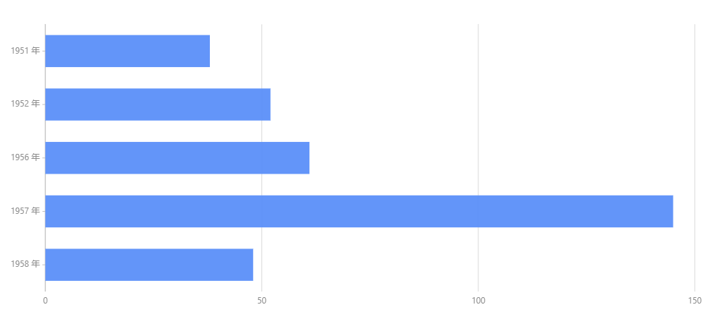

# API

AnyG 的核心技术架构非常简单，所有的 Graph 图表都继承于一个基类，基类为所有的图表提供了通用的 API 方法，而每个具体的可视化图表仅仅处理自己不同的配置项。所以 API 部分，所有图表基本都是一样。

## 获取 API 文档

API 文档链接：http://anyg.aishu.cn/zh/docs/api/plot-api
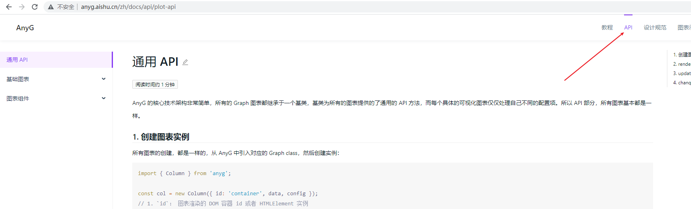

## 通用 API

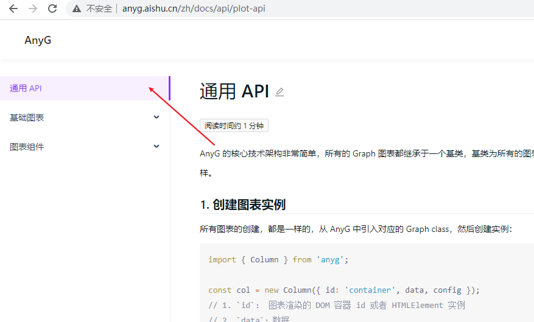

## 基础图表 API

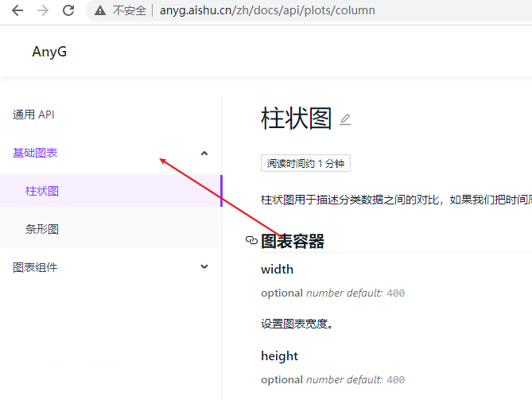

## 图表组件 API

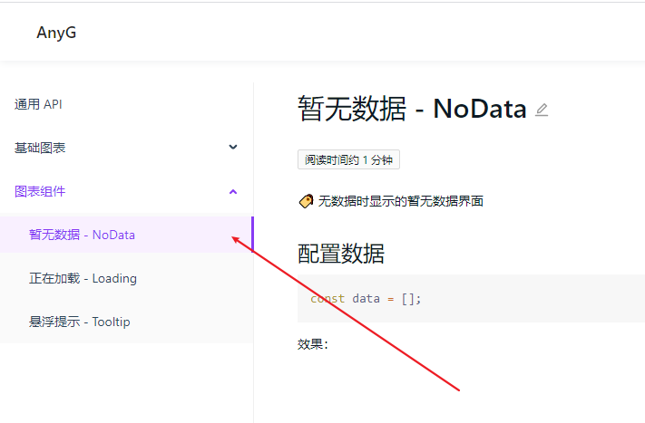

# 示例

## 查看完整图表示例

链接地址：http://anyg.aishu.cn/zh/examples/gallery
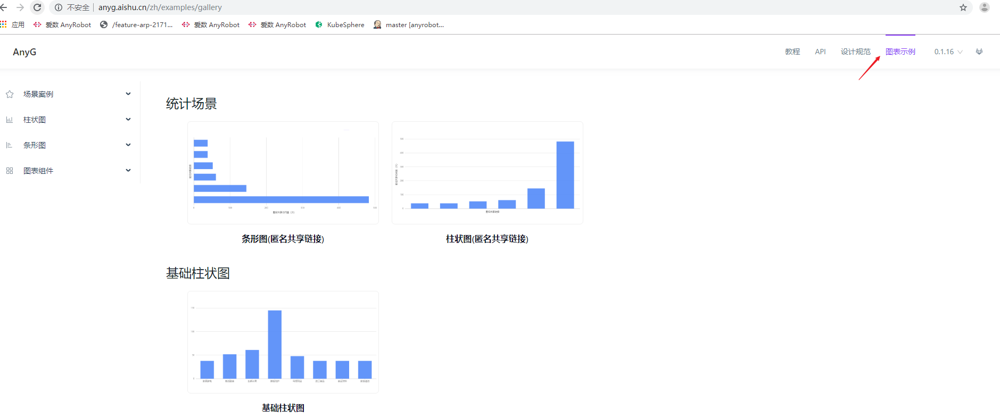

## 柱状图

### 示例代码

在线查看地址：https://codesandbox.io/s/thirsty-waterfall-9jpke?file=/src/App.js

### 示例图

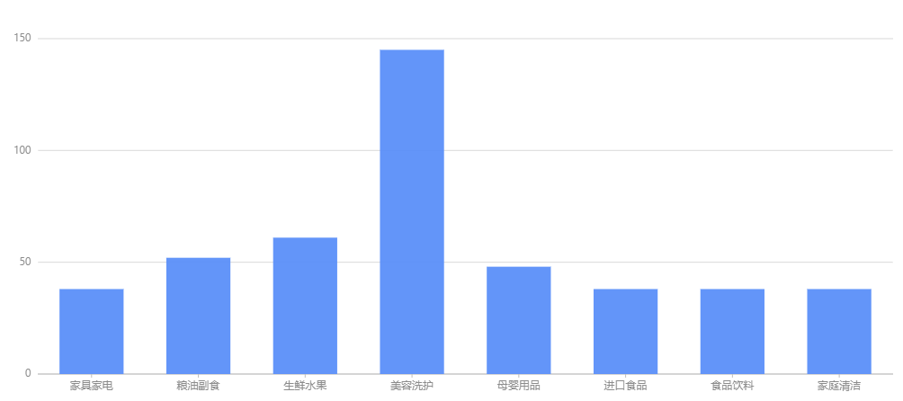

## 条形图

### 示例代码

在线查看地址：https://codesandbox.io/s/vibrant-https-x5by4?file=/src/App.js

### 示例图


## 图表组件

### 悬浮提示

### 示例代码

在线查看地址：https://codesandbox.io/s/vibrant-https-x5by4?file=/src/App.js

### 示例图

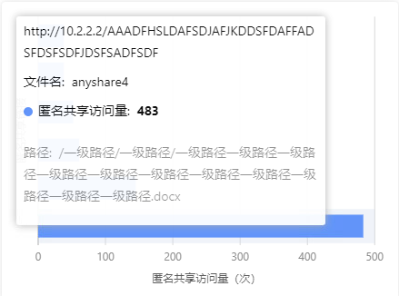

## 暂无数据

### 示例代码

在线查看地址：https://codesandbox.io/s/quizzical-khorana-yquv4?file=/src/App.js

### 示例图


## 正在加载

### 示例图

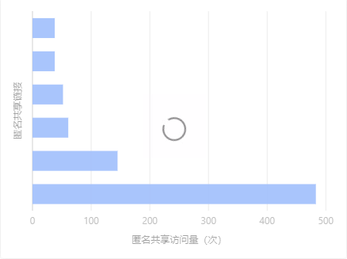

# 场景案例

## 条形图（匿名共享链接）

### 示例代码

在线查看地址：https://codesandbox.io/s/vibrant-https-x5by4?file=/src/App.js

### 示例图

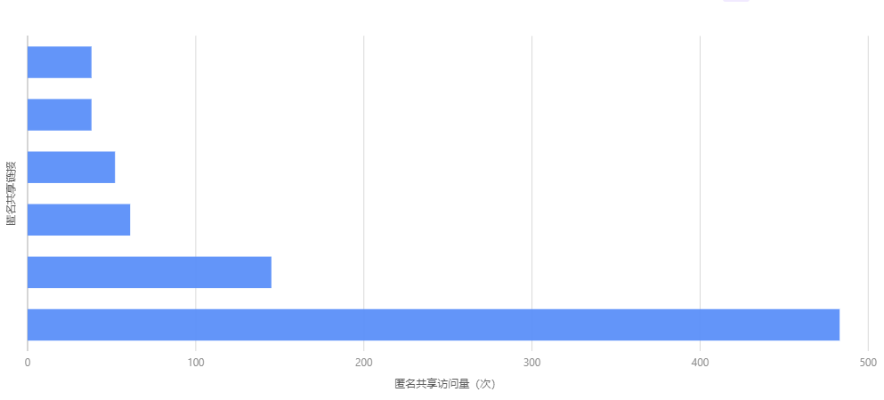

## 柱状图（匿名共享链接）

### 示例代码

在线查看地址：https://codesandbox.io/s/vibrant-https-x5by4?file=/src/App.js

### 示例图

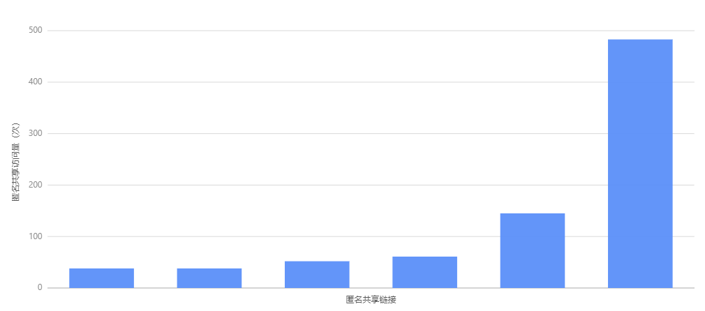

# 参考文件

G2Plot 官方文档：https://g2plot.antv.vision/zh/docs/api/plot-api
