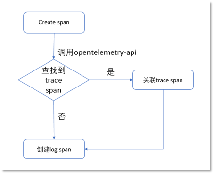
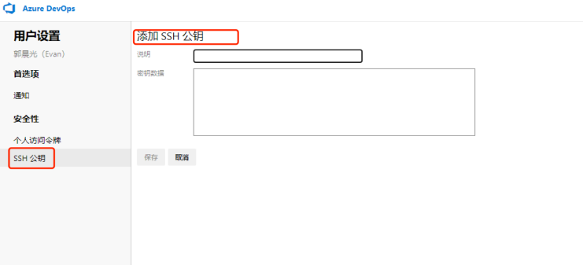
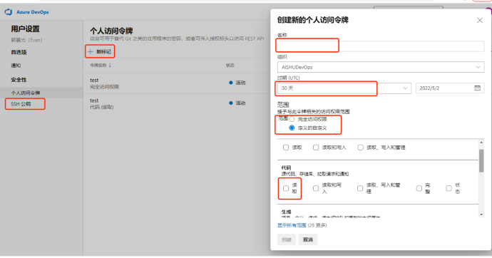
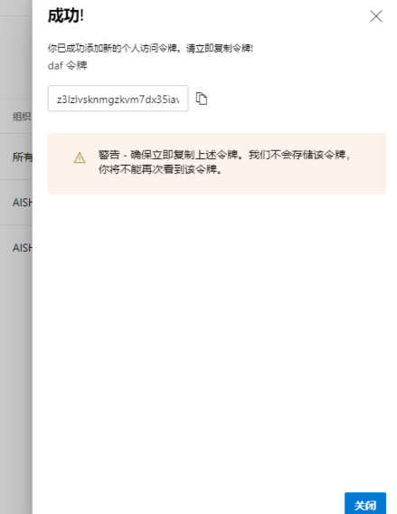

# Log
## 设计目标
### 传统日志局限性
传统日志没有包含自身的专业领域知识，而是隐含起来由采集、分析者赋予，而采集、分析者却不一定能够赋予。因为日志可以从不同的模块、不同的系统中采集，大家难以形成统一的共识，且会带来歧义。
例如：同一系统的不同模块由于业务要求不同在使用非结构化日志时有可能存在不同的字段，那么非结构化日志在采集时由于缺少对于知识或采集人员的相关认知不足，很容易在编写采集规则时出现错漏，影响整个日志的后续采集、存储和分析，给采集系统带来破坏。
### 结构化日志优势
#### 日志分析
在日志分析上，结构化日志代表了其结构化部分日志的专业领域知识的标准与公开，在开发阶段就实现的标准化。基于这个专业领域知识可以进行数据业务建模、数据解析优化、数据查询优化，数据分析场景化等。
#### 日志存储
在日志存储上，对结构化日志的部分结构，可以针对其结构化特性(甚至是不同的结构化部分)使用高效压缩和存储，包括对于数据的读写性能。
#### 日志采集
在日志采集上，结构化日志能够减少日志歧义，降低日志采集出错概率。场景化、固定化的结构化日志可以降低日志采集人员专业知识门槛。结构化的日志有利于对日志进行高压缩比的压缩，降低 IO 损耗。结构化日志有利于对日志采集性能进行优化。
#### **各系统结构化统一日志输出(Telemetry SDK)**
结构化日志是专业领域知识定义的，但如果对同一领域存在多种标准，则会影响使用者的同一认知，因此往往也会期望一个统一的标准，Telemetry SDK 基于 OpenTelemetry 对于日志相关数据采集和传输做了统一的标准化，当前 SDK 主要专注于数据输出的流程，提供灵活的数据结构表示log类型日志。
## 技术原理
### OpenTelemetry
#### 什么是 OpenTelemetry
OpenTelemetry 是一组标准、库、SDK 和代理，提供了完整的应用程序级可观察性。它使用与 OpenCensus 和 OpenTracing 相同的基于标准的方法，通过解耦应用程序工具和数据导出来帮助避免厂商锁定。他的核心工作主要集中在 3 个部分：

- 规范的制定，包括概念、协议、API，除了自身的协议外，还需要把这些规范和 W3C、GRPC 这些协议达成一致
- 相关 SDK、Tool 的实现和集成，包括各类语言的 SDK、代码自动注入、其他三方库（Log4j、LogBack 等）的集成
- 采集系统的实现，目前还是采用 OpenCensus 的采集架构，包括 Agent 和 Collector
#### OpenTelemetry 优势
标准和规范：
OpenTelemetry 采用了一种基于标准的实现方法。对标准的关注对于 OpenTelemetry 来说尤其重要，因为它需要追踪跨语言的互操作性。许多语言都带有类型定义，可以在实现中使用，例如用于创建可重用组件的接口。
SDK 规范实现以及更通用的 API：
SDK 是将导出器与API结合在一起的粘合剂。SDK 是具体的、可执行的API实现。OpenTelemetry 还发展了许多 OpenTracing 和OpenCensus API，引入了新的概念和抽象。例如，OpenTracing 有一个 span “标签”（ tag ）的概念，这是一种将键/值数据附加到单个 span 的方法。选择标签的最佳实践并没有改变，但是标签的概念已经被“注释”（ annotation ）所取代，“注释”是“标签”的一种更通用的形式。OpenTelemetry 已经为几个不同的组件引入了更多的通用抽象。
将 Metric、Tracing、Logging 结合：
下面是 Yuri Shkuro 画的原型设计：
```go
+----------------------------------------------------+
|                                                                 |
+------------+ custom application logic or specialized frameworks |
|            |                                                    |
|            +-------------------------------------+--------------+
|                                                  |
|    +---------+ +------+ +--------+               |
|    |         | |      | |        |               |
|    | metrics | | logs | | traces +---+           |
|    |         | |      | |        |   |           |
|    +----+----+ +---+--+ +---+----+   |           |
|         ^          ^        ^        |           |
|   +-----+----------+--------+-----+  |           |
|   |                               |  |           |
+--->            baggage            |  |           |
|                                   |  |           |
+---------------+-------------------+  |           |
                      |                |           |
+---------------------+----------------+-----------+-------------------+
              Universal context propagation layer <-----> marshaling
                                                             Plugins
```
在 OpenTelemetry 中试图使用 Context 为 Metrics、Logging、Tracing 提供统一的上下文，三者均可以访问到这些信息，由 OpenTelemetry 本身负责提供 Context 的存储和传播。

## 数据模型
### Log 数据介绍
Log 数据与系统以及业务挂钩，具有数据结构复杂多变、数据量与系统业务量相关的特点。
在某些时间敏感的场景下，对数据输出模块的调用要求可能较高。数据生成模块在数据对数据生成具有一定的连续性，从而形成数据上下文，那么数据输出模块应保持这种数据上下文关系，避免数据乱序。目前上下文关系通过 Trace 上下文进行关联，如果没有使用 openTelemetry 的 Trace 则自身创建当前 Log 的上下文
总的来说，数据输出模块应向上提供灵活的数据格式，保持数据上下文关系，性能上尽可能的不影响主业务运行，多数据输出场景下支持数据输出路由。
### 数据模型功能目标· 

- 向上提供灵活的数据结构表示 log 类型日志、基本 log 日志行为支持
- 可以继承 Trace 的上下文关系
- 支持多输出数据路由
- 数据元信息补充
- 数据开放标准兼容
- 数据的序列化
- 序列化数据的输出
#### Telemetry SDK 输出模块设计
由于业务的复杂与多变性，难以提供能够满足所有场景的数结构，因此采用分层的方式，在应用层的数据表示应有应用层转换为或使用日志输出模块提供的数据表现形式。
数据输出模块提供若干个数据结构提供给应用层使用，这些数据结构实现了数据输出模块的数据表示层，该层会贯彻整个数据输出模块。如果有必要再对提供的数据结构类型进行扩展。
##### 分层策略
根据数据输出模块的需求，我们将各个需求进行分层，不同的需求在不同的层次满足其需求。整个分层结构如下：

- 第一层数据输出层：负责将字节流输出到特定输出
- 第二层数据序列化层：负责将上层传入的数据表示按要求进行序列化
- 第三层数据开放协议层：负责将上层的传入的数据按数据开放标准进行转换与兼容，甚至添加一定的元信息
- 第四层日志运行输出时：负责将上层传入的数据，根据数据元信息与一定的策略进行数据路由，选择数据输出，并保证数据上下文关系
- 第五层数据表示层：实现对log类型数据的表示，并提供相应使用接口
- 第六层日志器操作层：提供基本的日志行为操作，负责对数据的日志级别过滤、采样率处理等，以及一定程度的易用性
- 第七层数据生成层：该层由上层应用系统实现，负责生成数据，并使用第五层提供的接口和数据结构表示，使用第六层进行数据记录
##### 分层优势

- 可以根据需要增加分层，提供更丰富的功能
- 灵活的增加分层实现，有利于扩展分层能力
- 对某层的职责变更或接口改写，仅会影响相邻层，影响较小
- 上层仅需要关注邻层接口，不需要关心其他层的使用
##### 数据上下文介绍
注：以下数据上下文适用于 2.0.0 及以上版本。
TelemetrySDK 为了将 Trace 数据和 Log 数据进行关联分析，支持从 Trace 上下文中读取上下文关系并继承到日志中
下面是 LogSpan 的创建流程：



通过内部调用 opentelemetry-api 将日志和 trace 进行关联，这样生成的日志可以跟 openTelemetry 中的 Trace 数据相关联，使得日志具备上下文关系。

##### 日志数据模型结构定义
注：以下数据结构适用于 2.0.0 及以上版本。

- LogSpan 结构定义：

| **字段名** | **类型** | **是否必须** | **描述** |
| --- | --- | --- | --- |
| Version | string | 是 | 表示数据内容协议版本，v1.6.1（和opentelemetry-specification版本保持一致） |
| TraceId | string | 是 | 分布式事务 ID，一个 trace 含有多个 span |
| SpanId | string | 是 | 子分布式事务ID，多个 span 组成 trace。span 间的父子关系和兄弟关系可以描述一次事务的内外调用关系 |
| Timestamp | int64 | 是 | 日志行时间戳，精确到纳秒 |
| SeverityText | string | 是 | 日志级别，字符串格式。从低到高对应为
Trace、Debug、Info、Warn、Error、Fatal |
| Body | Body**（Map）** | 是 | 一次日志记录行为，详细结构定义见下面的「Body 结构定义」 |
| Attributes | Attributes**(Map)** | 否 | 一次内部调用的业务属性，会继承父内部调用的业务属性。与 body 的区别在于 body 更倾向于系统内部具体描述，Attributes 倾向于对本次事务的描述。详细结构定义见下面的「**Attributes **结构定义」，不存在则为{} |
| Resource | Resource**(Map)** | 是 | 系统进程属性，与Attributes 区别在于attributes 更倾向于业务信息，resource 关注系统或进程上下文（不可以给应用程序进行设置，往往在日志器实例化时完成从服务信息上下文中填充） |

- Body 结构定义：

| **序号** | **key 字段名** | **value 类型** | **是否必须** | **描述** |
| --- | --- | --- | --- | --- |
| Body.1 | Type | string | 否 | 序号Body.1中"Type"分两种情况（Type类型需要统一管理）：
1. 序号1中"Type"默认为 Message，此时 Body.2 为字符串，在 json 序列化时会被序列化为 json 安全编码字符串；
2. 序号Body.1中"Type"存在时（Type类型需要统一管理）, Body.2 中Message 必须不能存在，且Body.2 中的 key 必须为 Body.1 中 Type 的 value 值，主要用于应用根据自己的需要扩展数据类型 |
| Body.2 | 上述 Type 对应的 value 值 | 任意类型 | 否 |  |

- Attributes 结构定义：

| **字段名** | **类型** | **是否必须** | **描述** |
| --- | --- | --- | --- |
| Type | string | 是 | 指明该 Attributes 的类型，该类型应该全局唯一，不可重复，避免数据冲突 |
| 上述Type对应的value值 | 任意类型 | 是 | 其他字段提供给使用者定义属性信息，该字段名为Type字段值，Type类型需要统一管理 |

- Resource 结构定义：

| **字段名** | **类型** | **是否必须** | **描述** | **值** |
| --- | --- | --- | --- | --- |
| Hostname | string | 是 | 节点主机名 | 主机名 |
| Telemetry.SDK.Name | string | 是 | sdk 名称 | Telemetry SDK |
| Telemetry.SDK.Version | string | 是 | sdk 版本号 | 2.0.0. |
| Telemetry.SDK.Language | string | 是 | sdk 开发语言 | 开发语言 |

## SDK2.0 使用参考
### Telemetry-Go
#### Telemetry SDK 安装和导入
>  golang 一般使用 go get 导入依赖库，但是基于 devops 代码仓库使用 go get 需要做一些权限配置，使用相对复杂

##### 使用方式（3选1）

1. 配置 SSH 公钥
1. 配置 PAT （Personal Access Token）
1. 使用 git clone + go mod replace

⚠️ 使用 PAT 方式存在的问题：

1. 由于 devpos 平台本身的原因，可能导致无法拉取
1. PAT 有效期最长为一年，需要定期修改

使用建议：
本地开发可以通过 SSH 方式拉取代码（方便）；Jenkins 构建通常无法使用 SSH 公钥方式，同时 PAT 方式也存在问题，可以使用 git clone + go mod replace 方式，下面详细介绍以上 3 种方式的配置过程。

首先设置 Go 环境变量
```python
go env -w GO111MODULE=on
go env -w GOPRIVATE=devops.aishu.cn
go env -w GOPROXY=https://goproxy.cn,direct
```
##### 配置 SSH 公钥方式

1. 创建 SSH 公钥 （以创建可跳过）
```python
ssh-keygen -C "{git账号}"
```

2. 将 公钥添加到 devops 平台 

登陆 Azure DevOps，点击右上角**个人头像 → 安全性 →SSH 公钥**、添加 SSH 公钥，将公钥复制到**秘钥数据**表单中，点击保存。


3. 配置 .gitconfig
> 说明：使用命令git config --global [user.name](http://user.name) "xxx"会生成.gitconfig，位于家目录下。

将下面配置写入 .gitconfig
```bash
[url "git@ssh.devops.aishu.cn:v3"]
insteadOf = https://devops.aishu.cn
```
##### 配置 PAT 方式

1. 创建 PAT

登陆 Azure DevOps，点击右上角**个人头像 → 安全性 → 个人访问令牌**、填写名称，设置过期时间，配置访问权限范围（至少配置**代码-读取权限**），点击创建。
创建成功后会生成访问令牌（token），点击按钮复制到剪贴板，用与下一步使用。



2. 配置  .gitconfig

将下面配置写入 .gitconfig, 并替换 **<user>** 和**<token>**，**<token> **为上一步生成的个人访问令牌，**<user> **可以替换为任意非空字符串，默认可填写：pat
```bash
[url "https://<user>:<token>@devops.aishu.cn"]
insteadOf = https://devops.aishu.cn
```
##### 导入sdk
直接使用 go get 导入 sdk 
```bash
go get -u devops.aishu.cn/AISHUDevOps/AnyRobot/_git/Akashic_TelemetrySDK-Go.git/span@2.0.0
```
如果以上两种方式遇到问题，或者不方便使用，可以使用下面 git clone + go mod replace 方式 
##### git clone + go mod replace 方式

1. 创建 PAT

同上

2. 将 sdk 代码 clone 到本地

执行下面的 shell 脚本,<PAT> 为上一步创建的 PAT
```bash
MY_PAT=<PAT>
B64_PAT=$(printf "%s"":$MY_PAT" | base64)
git -c http.extraHeader="Authorization: Basic ${B64_PAT}" clone -b 2.0.0 https://devops.aishu.cn/AISHUDevOps/AnyRobot/_git/Akashic_TelemetrySDK-Go
```
使用 go mod replace 进行本地替换
```bash
go mod edit -replace= devops.aishu.cn/AISHUDevOps/AnyRobot/_git/Akashic_TelemetrySDK-Go.git/span=<local_path>
```
#### 
#### 只记录日志
```bash
package main

import (
	"devops.aishu.cn/AISHUDevOps/AnyRobot/_git/Akashic_TelemetrySDK-Go.git/span/encoder"
	"devops.aishu.cn/AISHUDevOps/AnyRobot/_git/Akashic_TelemetrySDK-Go.git/span/field"
	"devops.aishu.cn/AISHUDevOps/AnyRobot/_git/Akashic_TelemetrySDK-Go.git/span/log"
	"devops.aishu.cn/AISHUDevOps/AnyRobot/_git/Akashic_TelemetrySDK-Go.git/span/open_standard"
	"devops.aishu.cn/AISHUDevOps/AnyRobot/_git/Akashic_TelemetrySDK-Go.git/span/runtime"
	"os"
	
)

var sampleLog *log.SamplerLogger


func main() {
	
	sampleLog = log.NewDefaultSamplerLogger()
	//// 此处demo output为标准输出
	output := os.Stdout
	writer := &open_standard.OpenTelemetry{
		Encoder: encoder.NewJsonEncoder(output),
	}
	writer.SetDefaultResources()
	run := runtime.NewRuntime(writer, field.NewSpanFromPool)
	sampleLog.SetRuntime(run)
	// start runtime
	go run.Run()

	sampleLog.SetLevel(log.TraceLevel)

	// 非结构化日志
	sampleLog.Info("this is a test")

	type LogModel struct {
		Model string
		Project string
	}
	var lm = LogModel{
		Model:   "main",
		Project: "test-demo",
	}

	attr := field.NewAttribute("logModel",field.MallocJsonField(lm))
	// 设置 attribute的日志
	sampleLog.Debug("this is a test with attribute",field.WithAttribute(attr))

	// 结构化日志
	sampleLog.InfoField(field.MallocJsonField(lm),"test")

	sampleLog.Close()
}
```
#### 记录日志和 trace
```bash
package main

import (
	"devops.aishu.cn/AISHUDevOps/AnyRobot/_git/Akashic_TelemetrySDK-Go.git/span/field"
	"devops.aishu.cn/AISHUDevOps/AnyRobot/_git/Akashic_TelemetrySDK-Go.git/span/log/easylog"
	"go.opentelemetry.io/otel/exporters/stdout/stdouttrace"
	tracesdk "go.opentelemetry.io/otel/sdk/trace"

	"context"
)

func main() {
	
	sampleLog := easylog.NewDefaultSamplerLogger()
	// trace Exporter
	exp, _ := stdouttrace.New(stdouttrace.WithPrettyPrint())

	tp := tracesdk.NewTracerProvider()

	tp.RegisterSpanProcessor(tracesdk.NewBatchSpanProcessor(exp))

	tr := tp.Tracer("trace_demo")
	ctx, s := tr.Start(context.Background(), "span_demo")
    // 将 上下文传入日志中，日志会自动获取 trace的上下文关系，使得 trace和log能根据traceID和spanID关联起来
	sampleLog.Info("span start",field.WithContext(ctx))
	// do something
	s.End()
	sampleLog.Info("span end",field.WithContext(ctx))
	
	sampleLog.Close()

	tp.Shutdown(ctx)
}
```
#### trace 开关
##### 静态开关
#export open_trace=true 设置环境变量      #unset open_trace 销毁环境变量
```bash
package main

import (
	"devops.aishu.cn/AISHUDevOps/AnyRobot/_git/Akashic_TelemetrySDK-Go.git/span/field"
	"devops.aishu.cn/AISHUDevOps/AnyRobot/_git/Akashic_TelemetrySDK-Go.git/span/log/easylog"
	"go.opentelemetry.io/otel/exporters/stdout/stdouttrace"
	tracesdk "go.opentelemetry.io/otel/sdk/trace"
	"os"
	"context"
)

func main() {
	
	sampleLog := easylog.NewDefaultSamplerLogger()

	exp, _ := stdouttrace.New(stdouttrace.WithPrettyPrint())

	tp := tracesdk.NewTracerProvider()
	// trace开关
	traceSwitch := os.Getenv("open_trace")
	if traceSwitch == "true"{
		tp.RegisterSpanProcessor(tracesdk.NewBatchSpanProcessor(exp))
	}
	tr := tp.Tracer("trace_demo")
	ctx, s := tr.Start(context.Background(), "span_demo")
	sampleLog.Info("span start",field.WithContext(ctx))
	// do something
	s.End()
	sampleLog.Info("span end",field.WithContext(ctx))

	sampleLog.Close()

	tp.Shutdown(ctx)
}
```
##### 动态开关
> 以下仅仅演示这种动态开关效果，应用集成时并不是这种方案，可能是外部接口/信号/配置中心触发。

```bash
package main

import (
	"context"
	"devops.aishu.cn/AISHUDevOps/AnyRobot/_git/Akashic_TelemetrySDK-Go.git/span/field"
	"devops.aishu.cn/AISHUDevOps/AnyRobot/_git/Akashic_TelemetrySDK-Go.git/span/log/easylog"
	"go.opentelemetry.io/otel/exporters/stdout/stdouttrace"
	tracesdk "go.opentelemetry.io/otel/sdk/trace"
)

func main() {

	sampleLog := easylog.NewDefaultSamplerLogger()
    defer sampleLog.Close()
	exp, _ := stdouttrace.New(stdouttrace.WithPrettyPrint())
	tp := tracesdk.NewTracerProvider()
	// 开启trace输出到终端
	tp.RegisterSpanProcessor(tracesdk.NewBatchSpanProcessor(exp))
	tr1 := tp.Tracer("trace_demo1")
	ctx, s := tr1.Start(context.Background(), "span_demo1")
	sampleLog.Info("span start",field.WithContext(ctx))
	// do something
	s.End()
	sampleLog.Info("span end",field.WithContext(ctx))
	tp.Shutdown(ctx)

	// 关闭 trace 输出
	tp.UnregisterSpanProcessor(tracesdk.NewBatchSpanProcessor(exp))
	tr2 := tp.Tracer("trace_demo2")
	ctx2, s2 := tr2.Start(context.Background(), "span_demo2")
	s2.End()
	tp.Shutdown(ctx2)
    
}
```
#### trace 分析
##### 部署 jaeger
```bash
docker run -d -p 16686:16686 -p 14268:14268 -p 6831:6831/udp jaegertracing/all-in-one
```
##### 将trace数据导入jaeger
```bash
package main

import (
	"context"
	"go.opentelemetry.io/otel"
	"go.opentelemetry.io/otel/attribute"
	"go.opentelemetry.io/otel/exporters/jaeger"
	"go.opentelemetry.io/otel/sdk/resource"
	tracesdk "go.opentelemetry.io/otel/sdk/trace"
	semconv "go.opentelemetry.io/otel/semconv/v1.4.0"
	"log"
	"time"
)

const (
	service     = "trace-demo"
	environment = "production"
	id          = 1
)

// tracerProvider returns an OpenTelemetry TracerProvider configured to use
// the Jaeger exporter that will send spans to the provided url. The returned
// TracerProvider will also use a Resource configured with all the information
// about the application.
func tracerProvider(url string) (*tracesdk.TracerProvider, error) {
	// Create the Jaeger exporter
	exp, err := jaeger.New(jaeger.WithCollectorEndpoint(jaeger.WithEndpoint(url)))
	if err != nil {
		return nil, err
	}
	tp := tracesdk.NewTracerProvider(
		// Always be sure to batch in production.
		tracesdk.WithBatcher(exp),
		// Record information about this application in an Resource.
		tracesdk.WithResource(resource.NewWithAttributes(
			semconv.SchemaURL,
			semconv.ServiceNameKey.String(service),
			attribute.String("environment", environment),
			attribute.Int64("ID", id),
		)),
	)
	return tp, nil
}


func main() {
	tp, err := tracerProvider("http://10.4.107.37:14268/api/traces")
	if err != nil{
		panic(err)
	}

	otel.SetTracerProvider(tp)

	ctx, cancel := context.WithCancel(context.Background())
	defer cancel()

	// Cleanly shutdown and flush telemetry when the application exits.
	defer func(ctx context.Context) {
		// Do not make the application hang when it is shutdown.
		ctx, cancel = context.WithTimeout(ctx, time.Second*5)
		defer cancel()
		if err := tp.Shutdown(ctx); err != nil {
			log.Fatal(err)
		}
	}(ctx)

	tr := tp.Tracer("component-main")


	ctx, span := tr.Start(ctx, "startReuqest")
	defer span.End()

}
```
##### 函数间调用示例
```bash
package main

import (
	"context"
	"go.opentelemetry.io/otel"
	"go.opentelemetry.io/otel/trace"
)

var tracer = otel.Tracer("example/main")

func parentFunction() {
	ctx := context.Background()
	var parentSpan trace.Span
	ctx, parentSpan = tracer.Start(ctx, "parent")
	defer parentSpan.End()
	// call our child function
	childFunction(ctx)
	// do more work, when this function ends, parentSpan will complete.
}

func childFunction(ctx context.Context) {
	var childSpan trace.Span
	ctx, childSpan = tracer.Start(ctx, "child")
	defer childSpan.End()
	// do work here, when this function returns, childSpan will complete.
}

func main() {
	parentFunction()
}

```
##### 服务间调用示例
Server:
```bash
package main

import (
	"context"
	"fmt"
	"go.opentelemetry.io/contrib/instrumentation/net/http/otelhttp"
	"go.opentelemetry.io/otel"
	"go.opentelemetry.io/otel/attribute"
	"go.opentelemetry.io/otel/baggage"
	"go.opentelemetry.io/otel/exporters/jaeger"
	"go.opentelemetry.io/otel/sdk/resource"
	tracesdk "go.opentelemetry.io/otel/sdk/trace"
	semconv "go.opentelemetry.io/otel/semconv/v1.4.0"
	"go.opentelemetry.io/otel/trace"
	"io"
	"net/http"
)

const (
	service     = "trace-demo"
	environment = "production"
	id          = 1
)

func tracerProvider(url string) (*tracesdk.TracerProvider, error) {
	// Create the Jaeger exporter
	exp, err := jaeger.New(jaeger.WithCollectorEndpoint(jaeger.WithEndpoint(url)))
	if err != nil {
		return nil, err
	}
	tp := tracesdk.NewTracerProvider(
		// Always be sure to batch in production.
		tracesdk.WithBatcher(exp),
		// Record information about this application in an Resource.
		tracesdk.WithResource(resource.NewWithAttributes(
			semconv.SchemaURL,
			semconv.ServiceNameKey.String(service),
			attribute.String("environment", environment),
			attribute.Int64("ID", id),
		)),
	)
	return tp, nil
}

func Server() {
	tp, err := tracerProvider("http://10.4.107.37:14268/api/traces")
	if err != nil {
		fmt.Println(err)
		return
	}

	defer func() {
		if err := tp.Shutdown(context.Background()); err != nil {
			fmt.Printf("Error shutting down tracer provider: %v", err)
		}
	}()

	uk := attribute.Key("username")

	helloHandler := func(w http.ResponseWriter, req *http.Request) {
		ctx := req.Context()
		span := trace.SpanFromContext(ctx)
		fmt.Println(span.SpanContext().TraceID().String())
		bag := baggage.FromContext(ctx)
		span.AddEvent("handling this...", trace.WithAttributes(uk.String(bag.Member("username").Value())))

		tr := otel.Tracer("next step")
		_, span1 := tr.Start(ctx, "next step")
		defer span1.End()
		fmt.Println(span1.SpanContext().TraceID().String())

		_, _ = io.WriteString(w, "Hello, world!\n")
	}

	otelHandler := otelhttp.NewHandler(http.HandlerFunc(helloHandler), "Hello")

	http.Handle("/hello", otelHandler)
	err = http.ListenAndServe(":7777", nil)
	if err != nil {
		panic(err)
	}
}
```
Client:
```bash
package main

import (
	"context"
	"flag"
	"fmt"
	"go.opentelemetry.io/contrib/instrumentation/net/http/httptrace/otelhttptrace"
	"go.opentelemetry.io/contrib/instrumentation/net/http/otelhttp"
	"go.opentelemetry.io/otel"
	"go.opentelemetry.io/otel/attribute"
	"go.opentelemetry.io/otel/baggage"
	"go.opentelemetry.io/otel/exporters/jaeger"
	"go.opentelemetry.io/otel/sdk/resource"
	tracesdk "go.opentelemetry.io/otel/sdk/trace"
	semconv "go.opentelemetry.io/otel/semconv/v1.4.0"
	"go.opentelemetry.io/otel/trace"
	"io/ioutil"
	"log"
	"net/http"
	"net/http/httptrace"
	"time"
)

const (
	service     = "trace-demo"
	environment = "production"
	id          = 1
)

func tracerProvider(url string) (*tracesdk.TracerProvider, error) {
	// Create the Jaeger exporter
	exp, err := jaeger.New(jaeger.WithCollectorEndpoint(jaeger.WithEndpoint(url)))
	if err != nil {
		return nil, err
	}
	tp := tracesdk.NewTracerProvider(
		// Always be sure to batch in production.
		tracesdk.WithBatcher(exp),
		// Record information about this application in an Resource.
		tracesdk.WithResource(resource.NewWithAttributes(
			semconv.SchemaURL,
			semconv.ServiceNameKey.String(service),
			attribute.String("environment", environment),
			attribute.Int64("ID", id),
		)),
	)
	return tp, nil
}

func Client() {
	time.Sleep(time.Second)
	tp, err := tracerProvider("http://10.4.107.37:14268/api/traces")
	if err != nil {
		fmt.Println(err)
		return
	}

	defer func() {
		if err := tp.Shutdown(context.Background()); err != nil {
			log.Printf("Error shutting down tracer provider: %v", err)
		}
	}()
	url := flag.String("server", "http://localhost:7777/hello", "server url")
	flag.Parse()

	client := http.Client{Transport: otelhttp.NewTransport(http.DefaultTransport)}

	bag, _ := baggage.Parse("username=donuts")
	ctx := baggage.ContextWithBaggage(context.Background(), bag)

	var body []byte

	tr := otel.Tracer("example/client")
	err = func(ctx context.Context) error {
		ctx, span := tr.Start(ctx, "say hello", trace.WithAttributes(semconv.PeerServiceKey.String("ExampleService")))
		defer span.End()
		fmt.Println(span.SpanContext().TraceID().String())
		ctx = httptrace.WithClientTrace(ctx, otelhttptrace.NewClientTrace(ctx))
		req, _ := http.NewRequestWithContext(ctx, "GET", *url, nil)

		fmt.Printf("Sending request...\n")
		res, err := client.Do(req)
		if err != nil {
			panic(err)
		}
		body, err = ioutil.ReadAll(res.Body)
		_ = res.Body.Close()

		return err
	}(ctx)

	if err != nil {
		panic(err)
	}
}
```
### **Telemetry-Python**
#### Telemetry SDK 安装和导入
```bash
git clone git@devops.aishu.cn/AISHUDevOps/AnyRobot/_git/Akashic_TelemetrySDK-Python
cd Akashic_TelemetrySDK-Python
pip install .
```
#### 只记录日志
```python
from tlogging import SamplerLogger

logger = SamplerLogger()
logger.loglevel = "TraceLevel"
# 非结构化日志
logger.trace("hello, this is trace log")
logger.debug("hello, this is debug log")
logger.info("hello, this is info log")
logger.warn("hello, this is warn log")
logger.error("hello, this is error log")
logger.fatal("hello, this is fatal log")

# 结构化日志
logger.trace({"a": 1, "b": 2}, etype="test")
```
#### 记录日志并添加 attributes
```python
from tlogging import SamplerLogger, Attributes
 
logger = SamplerLogger()
logger.loglevel = "TraceLevel"
 
attributes = Attributes({"a": "b"}, atype="test")
logger.info("hello, this is threading test", attributes=attributes)
```
#### 记录日志和 trace
```python
from opentelemetry import trace
from opentelemetry.sdk.trace import TracerProvider
from opentelemetry.sdk.resources import SERVICE_NAME, Resource
from opentelemetry.sdk.trace.export import (
    BatchSpanProcessor,
    ConsoleSpanExporter,
)
 
from tlogging import SamplerLogger, Attributes
'''
若需要开启trace功能，需要先安装opentelemetry-sdk依赖库，依赖库版本和opentelemetry-api版本一致。
例如 pip install opentelemetry-sdk==1.5.0
'''
trace.set_tracer_provider(
    TracerProvider(
        resource=Resource.create({SERVICE_NAME: "test"})
    )
)
trace.get_tracer_provider().add_span_processor(
    BatchSpanProcessor(ConsoleSpanExporter())
)
tracer = trace.get_tracer(__name__)
logger = SamplerLogger()
logger.loglevel = "TraceLevel"
 
with tracer.start_as_current_span("example-log2"):
    attributes = Attributes({"a": "b"}, atype="test")
    logger.info("this is threading test", attributes=attributes)
```
#### Trace 开关 
##### 静态开关
```python
from os import environ
from opentelemetry import trace
from opentelemetry.sdk.trace import TracerProvider
from opentelemetry.sdk.resources import SERVICE_NAME, Resource
from opentelemetry.sdk.trace.export import (
    BatchSpanProcessor,
    ConsoleSpanExporter,
)
 
from tlogging import SamplerLogger, Attributes
 
trace.set_tracer_provider(TracerProvider())
TRACE_SWITCH = str(environ.get("open_trace", "False"))
if TRACE_SWITCH in ["true", "True"]:
    trace.get_tracer_provider().add_span_processor(
        BatchSpanProcessor(ConsoleSpanExporter())
    )
 
tracer = trace.get_tracer(__name__)
logger = SamplerLogger()
logger.loglevel = "TraceLevel"
 
with tracer.start_as_current_span("example-log2"):
    attributes = Attributes({"a": "b"}, atype="test")
    logger.trace("this is threading test", attributes=attributes)
```
##### 动态开关
> 以下仅仅演示这种动态开关效果，应用集成时并不是这种方案，可能是外部接口/信号/配置中心触发

```python
from os import environ
from opentelemetry import trace
from opentelemetry.sdk.trace import TracerProvider
from opentelemetry.sdk.trace.export import (
    BatchSpanProcessor, ConsoleSpanExporter,
)
from tlogging import SamplerLogger
 
trace.set_tracer_provider(TracerProvider())
TRACE_SWITCH = str(environ.get("open_trace", "false"))
if TRACE_SWITCH in ["true", "True"]:
    trace.get_tracer_provider().add_span_processor(
        BatchSpanProces-sor(ConsoleSpanExporter(), max_export_batch_size=1))
# 下面的5个开、关函数只是演示这种动态开关效果，应用集成时并不是这种方案，可能是外部接口/信号/配置中心触发。
tracer = trace.get_tracer(__name__)
logger = SamplerLogger()
logger.loglevel = "TraceLevel"
def trace_open():
    trace.get_tracer_provider().add_span_processor(
        BatchSpanProces-sor(ConsoleSpanExporter(), max_export_batch_size=1))
def trace_close():
    trace.get_tracer_provider()._active_span_processor._span_processors = ()

with tracer.start_as_current_span("1"):
    trace_open()
with tracer.start_as_current_span("2"):
    trace_close()
with tracer.start_as_current_span("3"):
    trace_open()
with tracer.start_as_current_span("4"):
    trace_close()
with tracer.start_as_current_span("5"):
    trace_open()
# 只会输出1，3，5三个trace span
```
#### trace 分析
##### 部署 jaeger
```python
docker run -d -p 16686:16686 -p 14250:14250 -p 6831:6831/udp jaegertracing/all-in-one
```
##### 将 trace 数据导入 jaeger
```python
from opentelemetry import trace
from opentelemetry.sdk.trace import TracerProvider
from opentelemetry.sdk.resources import SERVICE_NAME, Resource
from opentelemetry.exporter.jaeger.thrift import JaegerExporter
from opentelemetry.sdk.trace.export import (
    BatchSpanProcessor, ConsoleSpanExporter,
)
 
from tlogging import SamplerLogger, Attributes
# 若需要将trace导入jaeger，需要先安装opentelemetry-exporter-jaeger依赖库，依赖库版本和opentelemetry-api版本一致.
trace.set_tracer_provider(
    TracerProvider(
        resource=Resource.create({SERVICE_NAME: "test"})
    )
)
jaeger_exporter = JaegerExporter(
    agent_host_name="localhost",
    agent_port=6831,
)
 
trace.get_tracer_provider().add_span_processor(
    BatchSpanProcessor(jaeger_exporter)
)
tracer = trace.get_tracer(__name__)
logger = SamplerLogger()
logger.loglevel = "TraceLevel"
 
with tracer.start_as_current_span("example-log2"):
    attributes = Attributes({"a": "b"}, atype="test")
    #可以用export open_trace="true"临时修改环境变量测试。
    logger.trace("this is threading test", attributes=attributes)
```
##### 函数间调用示例
```python
from opentelemetry import trace
from opentelemetry.sdk.trace import TracerProvider
from opentelemetry.sdk.resources import SERVICE_NAME, Resource
from opentelemetry.exporter.jaeger.thrift import JaegerExporter
from opentelemetry.sdk.trace.export import BatchSpanProcessor
from tlogging import SamplerLogger, Attributes

trace.set_tracer_provider(
    TracerProvider(
        resource=Resource.create({SERVICE_NAME: "test"})
    )
)
jaeger_exporter = JaegerExporter(
    agent_host_name="localhost",
    agent_port=6831,
)
trace.get_tracer_provider().add_span_processor(
    BatchSpanProcessor(jaeger_exporter)
)
tracer = trace.get_tracer(__name__)
logger = SamplerLogger()
logger.loglevel = "TraceLevel"

def parent():
    with tracer.start_as_current_span("parent"):
        attributes = Attributes({"a": "b"}, atype="test")
        logger.trace("this is parent threading test", attributes=attributes)
        child()

def child():
    with tracer.start_as_current_span("child"):
        attributes = Attributes({"a": "b"}, atype="test")
        logger.trace("this is child threading test", attributes=attributes)

if __name__=="__main__":
    parent()
```
##### 服务间调用示例
Server:
```python
import flask
from tlogging import SamplerLogger, Attributes
from opentelemetry import trace
from opentelemetry.instrumentation.flask import FlaskInstrumentor
from opentelemetry.instrumentation.requests import RequestsInstrumentor
from opentelemetry.sdk.trace import TracerProvider
from opentelemetry.sdk.trace.export import (
    BatchSpanProcessor, ConsoleSpanExporter,
)
from opentelemetry.exporter.jaeger.thrift import JaegerExporter
from opentelemetry.sdk.resources import SERVICE_NAME, Resource

trace.set_tracer_provider(
    TracerProvider(
        resource=Resource.create({SERVICE_NAME: "server"})
    )
)
trace.set_tracer_provider(TracerProvider())
trace.get_tracer_provider().add_span_processor(
    BatchSpanProcessor(ConsoleSpanExporter())
)

jaeger_exporter = JaegerExporter(
    agent_host_name="localhost",
    agent_port=6831,)
trace.get_tracer_provider().add_span_processor(
    BatchSpanProcessor(jaeger_exporter))

app = flask.Flask(__name__)
FlaskInstrumentor().instrument_app(app)
RequestsInstrumentor().instrument()

tracer = trace.get_tracer(__name__)
logger = SamplerLogger()
logger.loglevel = "TraceLevel"
@app.route("/")
def hello():
    with tracer.start_as_current_span("server"):
        attributes = Attributes({"a": "b"}, atype="test")
        logger.trace("test B",attributes=attributes)
    return "hello"
if __name__ == "__main__":
    app.run(port=7412)
```
CLient:
```python
import requests
from opentelemetry import trace
from opentelemetry.propagate import inject
from opentelemetry.sdk.trace import TracerProvider
from opentelemetry.sdk.resources import SERVICE_NAME, Resource
from opentelemetry.exporter.jaeger.thrift import JaegerExporter
from opentelemetry.sdk.trace.export import BatchSpanProcessor
from tlogging import SamplerLogger, Attributes

trace.set_tracer_provider(
    TracerProvider(
        resource=Resource.create({SERVICE_NAME: "client"})
    )
)
jaeger_exporter = JaegerExporter(
    agent_host_name="localhost",
    agent_port=6831,
)
trace.get_tracer_provider().add_span_processor(
    BatchSpanProcessor(jaeger_exporter)
)
tracer = trace.get_tracer(__name__)
logger = SamplerLogger()
logger.loglevel = "TraceLevel"

def client():

    with tracer.start_as_current_span("client"):
        attributes = Attributes({"a": "b"}, atype="test")
        header = {}
        inject(header)
        requests.get("http://127.0.0.1:7412",headers=header)
        logger.trace("test A", attributes=attributes)

if __name__=="__main__":
    client()
```

### Telemetry-CPP
#### TelemetrySDK 安装和导入
> 本工程是基于 groot 基础库进行开发的。

##### 编译

1. 下载依赖的groot库和头文件：
```bash
git submodule update --init
```

2. 初始环境变量:
```bash
source init_build_env.sh
```

3. 编译（后续的编译只能在当前窗口编译）：
```bash
cd src/build
cmake ../
make -j4
```
##### 使用方式
**基于groot的方式：**

1. 拷贝库和头文件

头文件：src/telemetrylog/ncTelemetryLog.h
编译出来的：libtelemetrylog.so
参考的.cmake文件：src/cmake/telemetrylog-config.cmake

2. 拷贝源码至自己的工程

.h文件：src/telemetrylog/ncTelemetryLog.h
.cpp文件：src/telemetrylog/ncTelemetryLog.cpp

**基于BaseCore的方式：**

1. 拷贝源码至自己的工程

.h文件：src/telemetrylog/ncTelemetryLog.h
.cpp文件：src/telemetrylog/ncTelemetryLog.cpp
#### 只记录日志
> 参考示例：src/test/ut_ncTelemetryLog.cpp

```cpp
// 设置日志的级别为INFO
ncTelemetryLog::getInstance()->SetLogLevel (NC_TELEMETRY_LOG_INFO);
· 单条字符串类型日志进行删除：
string iWantToOutPutString ("I want to out put this message");
ncTelemetryLogLevel logLevel = NC_TELEMETRY_LOG_WARN;

ncTelemetryLogAttribute emptyAttr;
// 第一种方式
ncTelemetryLog::getInstance()->PrintMsgToStderr (logLevel, iWantToOutPutString);
// 第二种方式
ncTelemetryLog::getInstance()->PrintMsgToStderr (logLevel, iWantToOutPutString, emptyAttr);
// 第三种方式
string convertJsonString = ncTelemetryLog::getInstance()->GetString(logLevel, iWantToOutPutString, emptyAttr);
ncTelemetryLog::PrintfToStderr(_T("%s\n"), convertJsonString.c_str());
// 单条自定义类型日志进行输出：
string bodyType ("SelfDefineEventType1");
JSON::Value bodyJson;
bodyJson ["UserId"] = 1122325235;
bodyJson ["UserName"] = "xiao.ming";
bodyJson ["FileName"] = "ReadMe.txt";
bodyJson ["Action"] = "Upload";
bodyJson ["FileSize"] = 10240;
bodyJson ["Time"] = 1624522824;
ncTelemetryLogLevel logLevel = NC_TELEMETRY_LOG_INFO;

ncTelemetryLogAttribute emptyAttr;
// 第一种方式
ncTelemetryLog::getInstance()->PrintMsgToStderr (logLevel, bodyType, bodyJson);
// 第二种方式
ncTelemetryLog::getInstance()->PrintMsgToStderr (logLevel, bodyType, bodyJson, emptyAttr);
// 第三种方式
string convertJsonString = ncTelemetryLog::getInstance()->GetString(logLevel, bodyType, bodyJson, emptyAttr);
ncTelemetryLog::PrintfToStderr(_T("%s\n"), convertJsonString.c_str());
// 单条字符串类型日志和 Attributes 进行输出：
string bodyType ("SelfDefineBodyType1");
JSON::Value bodyJson;
bodyJson["UserId"] = 1122325235;
bodyJson["UserName"] = "xiao.ming";
bodyJson["FileName"] = "ReadMe.txt";
bodyJson["Action"] = "Upload";
bodyJson["FileSize"] = 10240;
bodyJson["Time"] = 1624522824;
ncTelemetryLogLevel logLevel = NC_TELEMETRY_LOG_INFO;

ncTelemetryLogAttribute attribute;
attribute.SetAttribute("objectid", "BC89A79C66D11423798E");
attribute.SetAttribute("parentid", "ACE243243547E98B132C");

// 第一种方式
ncTelemetryLog::getInstance()->PrintMsgToStderr (logLevel, bodyType, bodyJson, attribute);
// 第二种方式
string convertJsonString = ncTelemetryLog::getInstance()->GetString(logLevel, bodyType, bodyJson, attribute);
ncTelemetryLog::PrintfToStderr(_T("%s\n"), convertJsonString.c_str());
```
C++ Telemetry-CPP暂不依赖开源组件opentelemetry-cpp，不支持trace功能
### Telemetry-JAVA
#### Telemetry SDK 安装和导入

##### 编译

1. 下载和安装 sdk（Maven方式）
```cpp
git clone https://devops.aishu.cn/AISHUDevOps/AnyRobot/_git/DE_TelemetryJava  -b 2.0.0
cd telemetry-java && mvn clean install
```

2. 在 pom.xml 中导入 sdk
```cpp
<groupId>com.eisoo</groupId>
<artifactId>SamplerLogger</artifactId>
<version>2.0.0</version>
```
#### 只记录日志
```cpp
//（可选）配置系统日志等级，默认是DEBUG
SamplerLogConfig.setLevel(Level.TRACE);
// 生成日志实例
Logger logger = LoggerFactory.getLogger(this.getClass());
// 打印字符串日志：“hello world”
logger.info("hello world");
//---------------------------

//打印自定义类型：Animal
private class Animal {
private String name;
private Integer age;

public Animal(String name, Integer age) {
this.name = name;
this.age = age;
}
}

 // 创建Animal实例
Animal animal = new Animal("little cat", 2);

// 创建日志体Body实例
Body body = new Body(); 
// 传入自定义类的类名：
body.setType("animal");
// 传入自定义类实例
body.setField(animal);

 // 生成日志实例
Logger logger = LoggerFactory.getLogger(this.getClass());

 // 打印自定义类实例日志：
logger.info(body);

// --------------------------------
//给attribute添加的自定义类型：Animal

// 创建日志体Attributes实例
Attributes attributes = new Attributes();
// 传入自定义类的类名：
attributes.setType("animalType");
// 传入自定义类实例
attributes.setField(animal);

// 生成日志实例
Logger logger = LoggerFactory.getLogger(this.getClass());
// 3. 打印字符串日志：“hello world”  
logger.info("hello world", attributes);
```
#### 记录日志和 trace
```cpp
//（可选）配置系统日志等级，默认是DEBUG
SamplerLogConfig.setLevel(Level.TRACE); 

// 生成日志实例
Logger logger = LoggerFactory.getLogger(this.getClass());

// 打印字符串日志：“hello world”
logger.info("hello world");


//通过maven引入相应的openTelemetry包，创建Trace和Span
Resource serviceNameResource =   Resource.create(io.opentelemetry.api.common.Attributes.of(ResourceAttributes.SERVICE_NAME, "otel-jaeger-example"));

// Set to process the spans by the Jaeger Exporter
SdkTracerProvider tracerProvider = SdkTracerProvider.builder()
.addSpanProcessor(SimpleSpanProcessor.create(new LoggingSpanExporter()))
.setResource(Resource.getDefault().merge(serviceNameResource))
.build();
OpenTelemetrySdk openTelemetry =
OpenTelemetrySdk.builder().setTracerProvider(tracerProvider).build();

// it's always a good idea to shut down the SDK cleanly at JVM exit.
Runtime.getRuntime().addShutdownHook(new Thread(tracerProvider::close));
final Tracer tracer = openTelemetry.getTracer("io.opentelemetry.example.JaegerExample");
Span span = tracer.spanBuilder("Start my wonderful use case").startSpan();
span.addEvent("Event 0");
final String message = "using existed traceId and spanId";
Logger logger = LoggerFactory.getLogger(this.getClass());  
logger.info(message, span.getSpanContext());
span.end();
```
